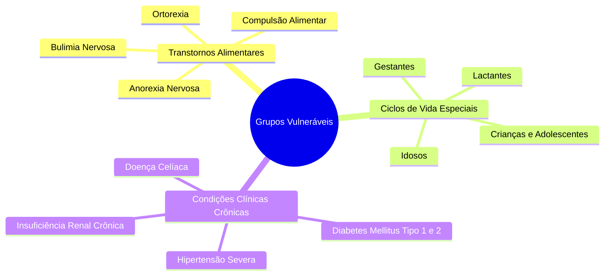

# Proteção de Grupos Vulneráveis e Filtros de Risco

> **Referência:** GQ-Ethics 2  
> **Responsável:** Maria Clara de Freitas Pina  
> **Status:** Em desenvolvimento  

---

## 1. Mapeamento de Públicos Vulneráveis

Recomendações nutricionais genéricas que funcionam razoavelmente bem para adultos saudáveis podem ser severamente danosas para grupos com demandas fisiológicas ou psicológicas particulares:

---

## 2. Filtros de Segurança por Grupo

---

## 3. Matriz de Decisão dos Filtros de Proteção

---
