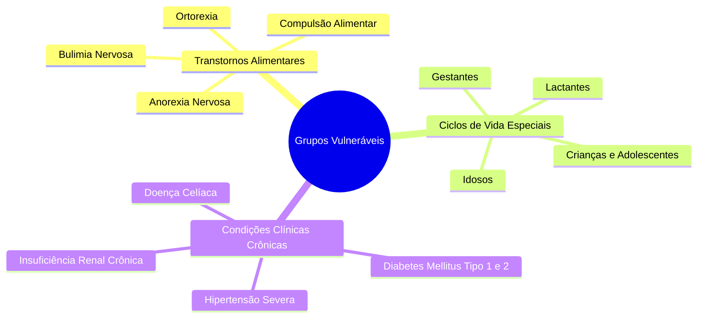

# Proteção de Grupos Vulneráveis e Filtros de Risco

> **Referência:** GQ-Ethics 2  
> **Responsável:** Maria Clara de Freitas Pina  
> **Status:** Em desenvolvimento  

---

## 1. Mapeamento de Públicos Vulneráveis

Recomendações nutricionais genéricas que funcionam razoavelmente bem para adultos saudáveis podem ser severamente danosas para grupos com demandas fisiológicas ou psicológicas particulares:

---

## 2. Filtros de Segurança por Grupo

Os filtros atuam na camada de entrada e processamento do prompt, aplicando regras específicas para cada púbico mapeado:

* **Transtornos Alimentares (TCA):** Bloqueio imediato de termos e métricas associados a comportamento purgativo, contagem obsessiva de calorias extremas ou apologia à magreza excessiva. O filtro interrompe a checagem padrão e ativa a resposta acolhedora de apoio.
* **Condições Clínicas Crônicas:** Detecção de restrições nutricionais severas sem acompanhamento (ex: corte total de carboidratos para diabéticos Tipo 1 ou restrição de sódio/potássio sem orientação para doentes renais). O filtro adiciona alertas explícitos de risco fisiológico.
* **Ciclos de Vida Especiais (Gestantes, Lactantes, Crianças e Idosos):** Identificação de perfis ou restrições alimentares aplicadas a esses grupos, exigindo que a IA ressalte a necessidade de acompanhamento médico e nutricional individualizado.

---

## 3. Matriz de Decisão dos Filtros de Proteção

| Grupo / Condição | Gatilho de Entrada (*Prompt*) | Ação do Filtro | Tipo de Resposta |
| :--- | :--- | :--- | :--- |
| **Transtornos Alimentares (Anorexia/Bulimia/Ortorexia)** | Menção a jejuns prolongados, uso de laxantes para emagrecer ou purgação. | **Interrupção de Checagem / Redirecionamento** | Recusa segura e acolhedora + Indicação de canais de apoio. |
| **Gestantes e Lactantes** | Consultas sobre dietas cetogênicas, restritivas ou uso de chás/suplementos emagrecedores. | **Alerta de Segurança + Filtro de Restrição** | Aviso sobre riscos de deficiência nutricional fetal/materna + Orientação para pré-natal. |
| **Doenças Crônicas (Diabetes, Insuficiência Renal, Celíacos)** | Dúvidas sobre exclusão radical de macronutrientes ou consumo de alimentos com potencial contaminação. | **Injeção de Contexto de Risco Clínico** | Resposta baseada em evidências + Disclaimer obrigatório sobre a complexidade da condição. |
| **População Geral (Alegações Populares sem Risco Imediato)** | Perguntas sobre mitos comuns (ex: "Água com limão em jejum emagrece?"). | **Fluxo Padrão de Checagem** | Avaliação científica normal + Citação de fontes com DOI + Disclaimer curto no rodapé. |

---
