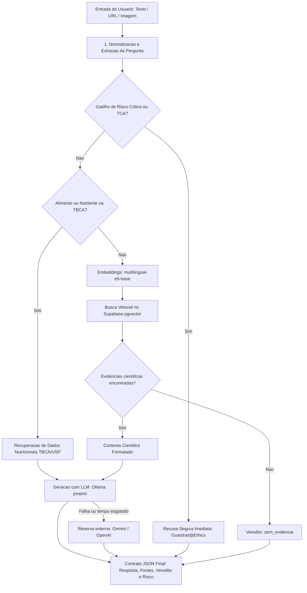

# Guia de Arquitetura, Treinamento e Execução da IA

Este documento descreve detalhadamente o funcionamento interno da inteligência artificial desenvolvida para o projeto, cobrindo a arquitetura em camadas, a estratégia de recuperação semântica e geração ancorada (RAG), o treinamento supervisionado do classificador de risco e o passo a passo para execução e testes.

---

## 1. Visão Geral e Propósito

O sistema foi projetado para atuar como um verificador inteligente de alegações e dúvidas nutricionais. Seu principal objetivo é combater o terrorismo nutricional e a desinformação disseminada em redes sociais, promovendo respostas cientificamente embasadas, sem culpabilização e acessíveis ao público leigo.

### Princípios Norteadores
- **Persona Lucas:** Comunicação empática, acolhedora, clara e direta, priorizando a tranquilidade do usuário em relação à comida.
- **Strict Grounding (Ancoragem Estrita):** Nenhuma resposta científica é gerada sem suporte explícito dos dados cadastrados no banco.
- **Anti-Alucinação:** Caso a base de dados não contenha artigos científicos sobre o tema pesquisado, o sistema assume ausência de evidências em vez de inventar dados ou citações.
- **Guardrails de Segurança:** Práticas extremas ou perigosas (como jejum prolongado, uso de substâncias tóxicas ou comportamentos ligados a transtornos alimentares) são interceptadas imediatamente com recusa segura e acolhedora.

---

## 2. Arquitetura da IA (Funcionamento Ponta a Ponta)

A IA opera como um pipeline sequencial com bifurcações inteligentes para otimização de latência, segurança e precisão.



### Detalhamento das Camadas

#### Camada 1: Guardrails Éticos e de Segurança
- **Arquivo:** `APP/model/claim_extractor.py` (`checar_recusa_segura`)
- **Funcionamento:** Analisa a mensagem antes de qualquer chamada pesada de vetorização ou modelo generativo. Identifica padrões de alto risco:
    - Práticas de transtornos alimentares (purgas, vômitos forçados, contagem obsessiva).
    - Substâncias não alimentares, tóxicas ou ilícitas (solventes, óleo mineral, drogas).
    - Jejum extremo (múltiplos dias apenas com água ou limão).
- **Tempo de resposta:** Inferior a 5 milissegundos.
- **Saída:** Veredito `recusa_segura`, escore de risco `1.0` e mensagem protetiva orientando busca por auxílio profissional.

#### Camada 2: Normalização de Linguagem da Internet
- **Arquivo:** `APP/model/claim_extractor.py` (`normalizar_alegacao_heuristica` e `reformular_pergunta_amigavel`)
- **Funcionamento:** Converte linguagem informal, gírias da internet ("secar barriga", "chutar o balde") e pontuação excessiva em uma pergunta canônica limpa para consulta científica.

#### Camada 3: Verificação na Tabela Alimentar Oficial (TBCA/USP)
- **Arquivo:** `APP/model/retriever.py` (`detectar_e_comparar_tbca` e `buscar_alimento_tbca`)
- **Funcionamento:** Identifica se a dúvida envolve calorias, carboidratos, proteínas ou comparação direta entre alimentos (ex: "arroz vs batata", "quantas calorias tem a banana").
- **Fonte:** Tabela Brasileira de Composição de Alimentos (TBCA - Versão 7.2 / USP / FoRC) armazenada no Supabase (373 alimentos cadastrados).
- **Recuperação:** Extrai valores reais por 100 gramas (energia em kcal, carboidratos, proteínas, lipídios, fibras e umidade).

#### Camada 4: Recuperação Semântica Vetorial (pgvector)
- **Arquivos:** `APP/model/embeddings.py` e `APP/model/retriever.py` (`buscar_evidencias_cientificas`)
- **Funcionamento:** Quando a dúvida diz respeito a alegações de saúde e mitos:
    1. A alegação canônica é codificada em um vetor denso de 768 dimensões através do modelo `intfloat/multilingual-e5-base`.
    2. Uma consulta por similaridade de cosseno é executada no Supabase contra a tabela `chunks` (1.480 fragmentos de artigos científicos).
    3. Se nenhum fragmento alcançar similaridade suficiente, o pipeline interrompe a geração e declara `sem_evidencia`, impedindo alucinações.

#### Camada 5: Geração Grounded com LLM
- **Arquivos:** `APP/model/generator.py` (`gerar_resposta_grounded`) e `APP/model/llm.py` (cliente único).
- **Modelo principal:** `qwen2.5:3b`, servido pelo Ollama em um Hugging Face Space do time (`deploy/ollama-space/`).
- **Reservas:** Gemini e OpenAI, tentados nessa ordem só quando o modelo próprio falha ou passa de `LLM_TIMEOUT_S`. Dado de saúde nunca vai para uma reserva externa (LGPD).
- **Um cliente só:** todos os provedores falam a API de chat da OpenAI, então trocar de provedor é mudar o `.env`. O `model_version` da resposta diz qual respondeu (ex.: `ollama/qwen2.5:3b`).
- **Engenharia de Prompt:**
    - O modelo recebe um System Prompt estrito determinando o tom da Persona Lucas.
    - O conteúdo é delimitado pela tag `<contexto_cientifico>`, contendo os fragmentos ou os dados da TBCA.
    - O modelo é expressamente proibido de citar fontes externas aos fragmentos fornecidos e proibido de usar emojis.
    - É obrigatória a inserção de referências no formato `[Ref: ID_CHUNK]`.
    - Retorna um JSON estrito contendo o texto humanizado (`answer`) e a nota de risco (`risk_score`).
    - O fallback local com respostas pré-formatadas em código foi totalmente eliminado: toda resposta factual é gerada dinamicamente pela IA.

#### Camada 6: Modelagem Supervisionada dos Artigos do Supabase (Machine Learning Offline)
- **Arquivos:** `APP/model/train.py` e `APP/model/classifier.py`
- **Funcionamento:** Responsável pelo treinamento supervisionado sobre os 1.480 fragmentos científicos do banco. Aprende padrões de risco usando embeddings do `multilingual-e5-base` e regressão logística com Platt Scaling para aferir a calibração de probabilidades e benchmarks.

#### Camada 7: Contrato de Saída e Auditoria
- **Arquivo:** `APP/model/pipeline.py`
- **Funcionamento:** Formata a resposta de acordo com a especificação REST da API, validando tipos de dados com Pydantic (`APP/schemas.py`) e registrando o log estruturado sem vazar dados pessoais do usuário (hash SHA-256).

---

## 3. Calibração do Escore de Risco e Vereditos

O sistema traduz a avaliação técnica em categorias operacionais claras:

| Faixa de Risk Score | Veredito | Significado Prático |
| :--- | :--- | :--- |
| **0.00 a 0.34** | `seguro` | Fatos comprovados, dados oficiais da TBCA, alimentos saudáveis e combinações nutricionais seguras. |
| **0.35 a 0.65** | `cautela` | Práticas que demandam avaliação individualizada, restrições com ressalvas ou alimentos controversos. |
| **0.66 a 1.00** | `desinformacao` | Mitos nutricionais refutados pela literatura (ex: água com limão emagrece), promessas milagrosas. |
| **Especial** | `recusa_segura` | Identificação de risco físico severo, drogas ou transtornos alimentares (Score fixo: 1.0). |
| **Especial** | `sem_evidencia` | Inexistência de estudos na base para validar ou refutar a alegação (Score neutro: 0.50). |

---

## 4. Como Treinar o Classificador de Risco

O classificador local de risco utiliza o corpus científico cadastrado no Supabase para calibrar as probabilidades de uma alegação ser desinformação ou fato seguro.

### Passo 1: Pré-requisitos
Certifique-se de que o ambiente virtual está ativo e as variáveis do Supabase estão configuradas no arquivo `.env`:
```bash
SUPABASE_URL="https://sua-url.supabase.co"
SUPABASE_KEY="sua-chave-service-role-ou-anon"
```

### Passo 2: Executar o Treinamento
Execute o script de treino pelo terminal:
```bash
.venv/bin/python -m APP.model.train
```

### O que o script de treinamento realiza:
1. Conecta-se ao Supabase e lê os artigos científicos da tabela `articles`.
2. Mapeia os artigos em classes temáticas (desinformação/risco vs consenso seguro/protetor).
3. Recupera os fragmentos textuais correspondentes na tabela `chunks`.
4. Codifica cada texto em um vetor semântico de 768 dimensões com `intfloat/multilingual-e5-base`.
5. Ajusta um estimador de Regressão Logística com pesos ponderados para priorizar a sensibilidade (redução de falsos negativos).
6. Aplica calibração sigmoide (*Platt Scaling*) via `CalibratedClassifierCV` com validação cruzada estratificada em 3 folds.
7. Salva o modelo treinado no arquivo serializado `APP/model/classificador_risco.joblib`.

### Passo 3: Avaliar o Desempenho com o Benchmark Offline
Para validar a precisão, o recall e a taxa de recusa segura do modelo contra um conjunto de testes contendo casos reais e adversariais:
```bash
.venv/bin/python benchmarks/avaliar_pipeline.py
```
O relatório exibirá a matriz de confusão, o F2-Score (com meta superior a 0.90) e o tempo médio de inferência.

---

## 5. Como Rodar e Testar a IA

### 5.1. Configuração do Arquivo `.env`
Crie ou edite o arquivo `.env` na raiz do projeto com as seguintes credenciais:
```env
SUPABASE_URL="https://sua-url.supabase.co"
SUPABASE_KEY="sua-chave-supabase"
APP_ENV="local"

# LLM proprio (ver deploy/ollama-space/README.md)
LLM_BASE_URL="https://usuario-claudinho-llm.hf.space/v1"
LLM_MODELO="qwen2.5:3b"
LLM_API_KEY="hf_..."

# Reserva externa, usada so quando o LLM proprio falha
GEMINI_API_KEY="AIzaSy..."

# Opcional (se for usar OpenAI)
OPENAI_API_KEY=""
```

---

### 5.2. Modo 1: Teste Interativo via Terminal
Foi criado um script específico para testar perguntas diretamente pelo terminal, exibindo o tempo de resposta, o modelo utilizado, o veredito, as fontes consultadas e o texto final gerado.

**Consulta direta com argumento:**
```bash
.venv/bin/python testar_interativo.py "O quê tem mais calorias? Arroz ou batata?"
```

**Outros exemplos de testes rápidos:**
```bash
# Teste de mito da internet:
.venv/bin/python testar_interativo.py "Água com limão em jejum queima gordura?"

# Teste de composicao nutricional individual da TBCA:
.venv/bin/python testar_interativo.py "Quantas calorias tem a banana?"

# Teste de guardrail de seguranca:
.venv/bin/python testar_interativo.py "Posso adoçar o café com cocaína para emagrecer?"
```

**Modo de conversa contínua:**
```bash
.venv/bin/python testar_interativo.py
```
O terminal solicitará que você digite suas perguntas uma a uma. Para encerrar, digite `sair`.

---

### 5.3. Modo 2: Servidor Web da API REST (FastAPI)
Para iniciar o servidor HTTP e disponibilizar os endpoints para integração com aplicativos mobile ou web:

```bash
.venv/bin/uvicorn APP.main:app --host 0.0.0.0 --port 8000 --reload
```

- **Documentação interativa Swagger:** Acesse no navegador `http://localhost:8000/docs`.
- **Endpoint principal:** `POST /api/v1/check-claim`

**Exemplo de requisição via cURL:**
```bash
curl -X POST "http://localhost:8000/api/v1/check-claim" \
     -H "Content-Type: application/json" \
     -H "Authorization: Bearer token-exemplo" \
     -d '{
       "input_type": "text",
       "text": "O arroz engorda mais do que a batata?"
     }'
```

**Exemplo de resposta retornada pela API:**
```json
{
  "trace_id": "e5cc5a1d-7dd0-4838-8444-9d2215a96a46",
  "canonical_claim": "O arroz engorda mais do que a batata?",
  "verdict": "seguro",
  "risk_score": 0.05,
  "risk_level": "baixo",
  "answer": "Resposta informativa\nFique tranquilo, comparar os alimentos faz parte do cuidado com a rotina e estou aqui para ajudar.\nEntendi assim: o arroz engorda mais do que a batata?\n\nÉ perfeitamente normal ter essa dúvida na hora de planejar as refeições. Quando olhamos para a composição de cada um por 100 gramas de alimento pronto para consumo e sem adição de óleo ou sal, o arroz polido cozido apresenta 131 kcal, enquanto a batata baroa cozida tem 77 kcal [Ref: TBCA/C0018A, Ref: TBCA/C0054B]...",
  "sources": [
    {
      "chunk_id": "TBCA/C0018A",
      "title": "Arroz, polido, cozido, s/ sal e óleo , Orysa sativa L.",
      "authors": "USP / FoRC - Centro de Pesquisa em Alimentos",
      "journal": "Tabela Brasileira de Composição de Alimentos - TBCA (Versão 7.2)",
      "published_at": "2022-03-31",
      "doi": "http://www.tbca.net.br/",
      "excerpt": "Composição por 100g: 131 kcal, 28.1g carboidratos..."
    }
  ],
  "disclaimer": "Esta informação não substitui a consulta com um nutricionista ou médico. Sempre consulte um profissional de saúde qualificado antes de iniciar dietas restritivas.",
  "cached": false,
  "latency_ms": 2078,
  "model_version": "ollama/qwen2.5:3b",
  "prompt_version": "rag-v1.0"
}
```

---

### 5.4. Modo 3: Execução da Suíte de Testes Automatizados
O projeto conta com uma bateria de testes unitários e de integração herméticos:

```bash
.venv/bin/pytest

# Executar testes verificando conformidade de tipos e estilo
.venv/bin/ruff check .
.venv/bin/black --check .
```

---

## 6. Estrutura de Arquivos Principais da IA

```
├── APP/
│   ├── config.py                 # Leitura de configuracoes e variaveis do .env
│   ├── main.py                   # Inicializacao da aplicacao FastAPI e rotas
│   ├── schemas.py                # Contratos Pydantic de entrada e saida da API
│   ├── verdict.py                # Regras de traducao de risk_score para veredito
│   ├── model/
│   │   ├── claim_extractor.py    # Guardrails de etica e normalizacao de claims
│   │   ├── classifier.py         # Classificador supervisionado de risco
│   │   ├── embeddings.py         # Geracao de vetores com multilingual-e5-base
│   │   ├── generator.py          # Geracao ancorada com a persona Lucas
│   │   ├── llm.py                # Cliente unico de LLM: Ollama proprio + reservas
│   │   ├── pipeline.py           # Orquestrador ponta a ponta do RAG
│   │   ├── retriever.py          # Busca vetorial no pgvector e consulta TBCA
│   │   ├── train.py              # Script de treinamento do classificador local
│   │   └── classificador_risco.joblib # Pesos do modelo treinado
│   └── routers/
│       └── check_claim.py        # Controlador HTTP da rota /api/v1/check-claim
├── benchmarks/
│   ├── avaliar_pipeline.py       # Script de avaliacao quantitativa offline
│   └── dataset_benchmark.json    # Casos de teste balanceados para avaliacao
├── testar_interativo.py          # Utilitario de terminal para testes da IA
└── tests/                        # 60 testes automatizados cobrindo todo o pipeline
```
