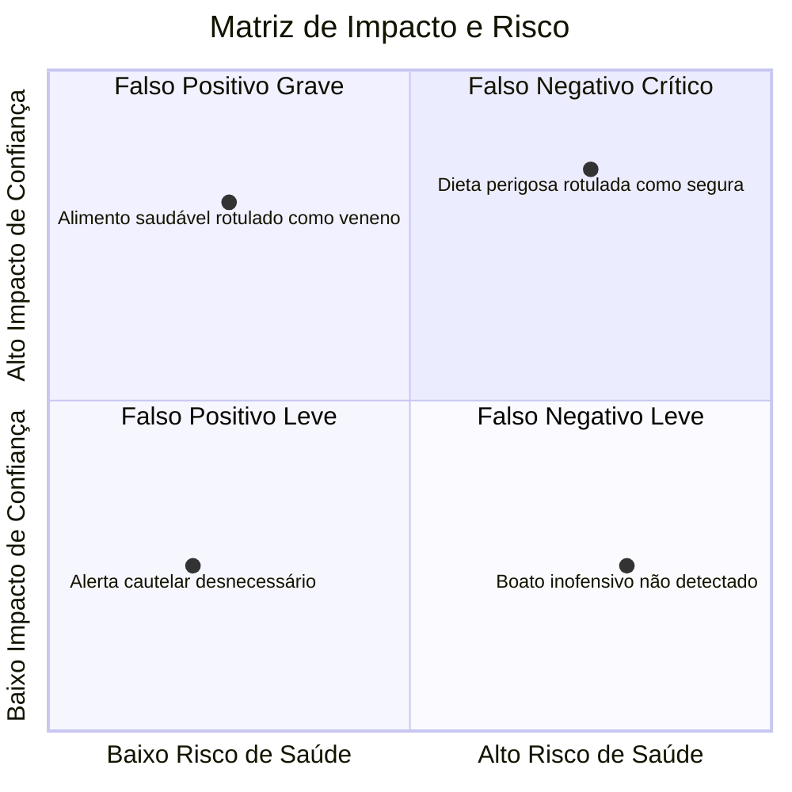
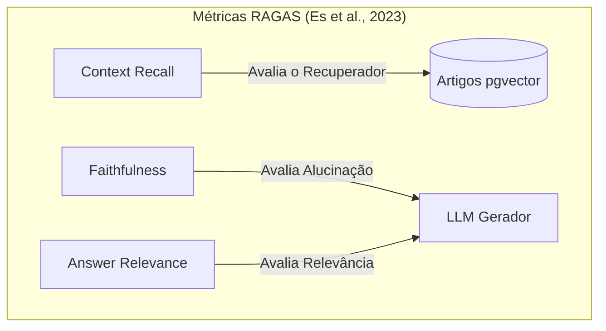
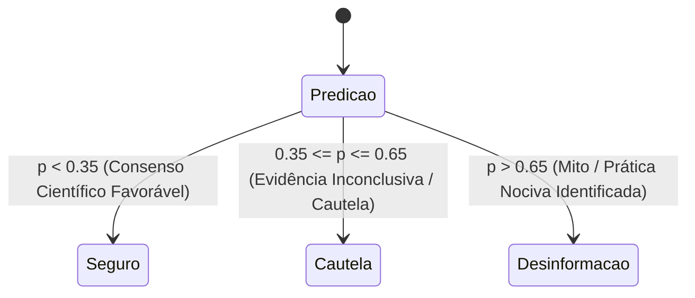

# Métricas de Avaliação e Gestão de Riscos (FP vs FN)

> **Referência:** GQ-Model 1  
> **Responsável:** Ana Luiza Hoffmann Ferreira  
> **Status:** Em desenvolvimento  

---

## 1. Trade-off: Falso Positivo vs. Falso Negativo em Saúde Nutricional

No contexto de detecção de desinformação nutricional, a definição do que constitui **Positivo** e **Negativo** deve ser clara:
* **Classe Positiva (1):** Conteúdo com **Desinformação / Fake News / Risco à Saúde**.
* **Classe Negativa (0):** Conteúdo **Verdadeiro / Baseado em Evidências / Seguro**.

### Análise dos Erros:
1. **Falso Negativo (FN) — RISCO CRÍTICO À SAÚDE:**
   * O sistema classifica como "Verdadeiro/Seguro" um post que promove uma prática perigosa (ex: ingestão de substâncias hepatotóxicas como "queimadores de gordura", jejum hídrico de 7 dias, exclusão total de grupos alimentares para crianças).
   * **Consequência:** Danos físicos reais ao usuário, problemas renais/hepáticos, piora de transtornos alimentares.
2. **Falso Positivo (FP) — RISCO DE CREDIBILIDADE E ANSIEDADE:**
   * O sistema classifica como "Fake News/Perigoso" uma informação nutricional legítima e segura (ex: dizer falsamente que o Guia Alimentar está errado ou que arroz e feijão fazem mal).
   * **Consequência:** Perda de confiança na IA, reforço do terrorismo nutricional e restrição indevida de alimentos saudáveis.

---

## 2. Métricas Quantitativas Priorizadas

### 2.1. Recall / Sensibilidade (Prioridade Máxima)
Mede a proporção de conteúdos desinformativos/perigosos reais que o modelo conseguiu identificar corretamente:

$$\text{Recall} = \frac{TP}{TP + FN}$$

* **Fundamentação Teórica:** Em aplicações biomédicas e de segurança pública, o custo do erro assimétrico exige foco no Recall (*Powers, 2011*).
* **Meta:** $\text{Recall} > 0.95$ para alegações com potencial de dano à saúde física.

---

### 2.2. $F_\beta$-Score e $F_2$-Score (Métrica Principal de Otimização)
O $F_\beta$-Score deriva da teoria de recuperação da informação formulada por **Van Rijsbergen (1979)** e padronizada em NLP por **Chinchor (1992)**:

$$F_\beta = (1 + \beta^2) \cdot \frac{\text{Precision} \cdot \text{Recall}}{(\beta^2 \cdot \text{Precision}) + \text{Recall}}$$

O parâmetro $\beta$ determina o peso relativo entre *Precision* e *Recall*. Ao definir $\beta = 2$, o modelo atribui **o dobro de importância ao Recall em relação à Precision** ($F_2$-Score):

$$F_2 = (1 + 2^2) \cdot \frac{\text{Precision} \cdot \text{Recall}}{(2^2 \cdot \text{Precision}) + \text{Recall}} = 5 \cdot \frac{\text{Precision} \cdot \text{Recall}}{4 \cdot \text{Precision} + \text{Recall}}$$

* **Justificativa da escolha do $F_2$:** Como deixar passar um *Falso Negativo* (post nocivo rotulado como seguro) é muito mais grave do que gerar um *Falso Positivo* (alerta cautelar sobre um estudo inconclusivo), o $F_2$-Score penaliza fortemente modelos com baixo Recall, sem ignorar totalmente a precisão.

---

### 2.3. PR-AUC (Precision-Recall AUC) vs. ROC-AUC
* **Fundamentação Teórica (*Saito & Rehmsmeier, 2015*):** Em cenários de desbalanceamento de classes (onde a proporção de boatos nutricionais extremos é muito menor que o volume total de posts), a curva ROC pode inflar a percepção de desempenho devido à grande quantidade de *Verdadeiros Negativos* ($TN$).
* A área sob a curva Precision-Recall (**PR-AUC**) foca exclusivamente na classe minoritária positiva, refletindo o desempenho real do classificador.

---

## 3. Métricas de Avaliação de RAG (*Generation & Retrieval*)

Para mensurar a confiabilidade do pipeline de RAG e prevenir alucinações de artigos científicos, adotamos o framework formal **RAGAS (Retrieval Augmented Generation Assessment)** proposto por **Es et al. (2023)**:

### 3.1. Fidelidade (*Faithfulness* — Anti-Alucinação)
Mede se todas as alegações feitas na resposta gerada pelo LLM ($S$) podem ser diretamente inferidas a partir do contexto científico recuperado ($C$):

$$\text{Faithfulness} = \frac{|V|}{|\text{Total de alegações em } S|}$$

* Onde $V$ é o conjunto de sentenças/afirmações da resposta que possuem sustentação lógica nos fragmentos de artigos fornecidos.
* **Meta no MVP:** $\text{Faithfulness} \ge 0.90$ (tolerância quase nula para fatos inventados).

---

### 3.2. Relevância da Resposta (*Answer Relevance*)
Mede se a resposta atende à dúvida do usuário sem divagações. O framework RAGAS gera $n$ perguntas sintéticas ($q_i$) a partir da resposta gerada e calcula a média da similaridade de cosseno com a pergunta original ($q$):

$$\text{Answer Relevance} = \frac{1}{n} \sum_{i=1}^{n} \text{sim}(\mathbf{E}_{g}(q), \mathbf{E}_{g}(q_i))$$

* Onde $\mathbf{E}_g$ representa o modelo de embedding de avaliação e $\text{sim}$ é a similaridade de cosseno.
* **Meta no MVP:** $\text{Answer Relevance} \ge 0.85$.

---

### 3.3. Recall do Contexto (*Context Recall*)
Mede se o mecanismo de busca vetorial (`pgvector`) recuperou todos os fragmentos científicos relevantes necessários para responder à pergunta, comparando com respostas padrão-ouro anotadas por especialistas:

$$\text{Context Recall} = \frac{|\text{Sentenças do padrão-ouro atribuíveis ao contexto recuperado}|}{|\text{Total de sentenças do padrão-ouro}|}$$

* **Meta no MVP:** $\text{Context Recall} \ge 0.85$.

---

## 4. Calibração de Threshold de Decisão (*Cost-Sensitive Learning*)

A definição do limiar de classificação não deve ser arbitrária ($0.5$). Baseia-se no teorema de aprendizagem sensível ao custo (**Cost-Sensitive Learning**) formalizado por **Charles Elkan (2001)**:

### 4.1. Formulação Teórica do Limiar Ótimo
Dado o custo de um Falso Positivo $C(FP)$ e o custo de um Falso Negativo $C(FN)$, o limiar probabilístico ótimo $p^*$ para classificar uma instância como positiva (desinformação/risco) é dado por:

$$p^* = \frac{C(FP) - C(TN)}{C(FP) - C(TN) + C(FN) - C(TP)}$$

Assumindo custo zero para acertos ($C(TN) = C(TP) = 0$), a equação se simplifica para:

$$p^* = \frac{C(FP)}{C(FP) + C(FN)}$$

### 4.2. Aplicação ao Projeto:
* Na saúde alimentar, deixar passar uma prática danosa ($FN$) tem custo estimado **2 a 3 vezes maior** que levantar um alerta preventivo sobre estudo inconclusivo ($FP$).
* Se $C(FN) = 2 \cdot C(FP)$:
  $$p^* = \frac{1}{1 + 2} = \frac{1}{3} \approx 0.33 \implies \text{Ajuste operacional para } \mathbf{0.35}$$

---

## 5. Próximos Passos
- [ ] Construir o dataset de validação (*Ground Truth Benchmark*) com 50 perguntas rotuladas por especialistas/nutricionistas.
- [ ] Integrar biblioteca `ragas` no pipeline de avaliação contínua do modelo.
- [ ] Calibrar as probabilidades preditas utilizando *Platt Scaling* ou *Isotonic Regression* (*Niculescu-Mizil & Caruana, 2005*).

---

## 6. Referências Bibliográficas

1. **Van Rijsbergen, C. J. (1979).** *Information Retrieval* (2nd ed.). London: Butterworths.  
   *(Introdução formal das funções de avaliação e da parametrização do $F_\beta$-Score na teoria da recuperação da informação).*

2. **Chinchor, N. (1992).** *MUC-4 Evaluation Metrics*. In Proceedings of the 4th Message Understanding Conference (MUC-4), pp. 22-29.  
   *(Padronização do uso de Precision, Recall e $F$-Scores em Processamento de Linguagem Natural).*

3. **Powers, D. M. W. (2011).** *Evaluation: From Precision, Recall and F-Measure to ROC, Informedness, Markedness & Correlation*. Journal of Machine Learning Technologies, 2(1), 37-63.  
   *(Discussão sobre o impacto do viés de custo e seleção de métricas em tarefas críticas).*

4. **Saito, T., & Rehmsmeier, M. (2015).** *The Precision-Recall Plot Is More Informative than the ROC Plot When Evaluating Imbalanced Datasets*. PLoS ONE, 10(3), e0118432. [DOI: 10.1371/journal.pone.0118432](https://doi.org/10.1371/journal.pone.0118432).  
   *(Demonstração matemática da superioridade do PR-AUC sobre ROC-AUC em conjuntos de dados desbalanceados).*

5. **Es, S., James, J., Espinosa-Anke, L., & Schockaert, S. (2023).** *RAGAS: Automated Evaluation of Retrieval Augmented Generation*. arXiv preprint [arXiv:2309.15217](https://arxiv.org/abs/2309.15217).  
   *(Artigo original que define formalmente as métricas de Faithfulness, Answer Relevance e Context Recall para sistemas RAG).*

6. **Lewis, P., Perez, E., Piktus, A., Petroni, F., Karpukhin, V., Goyal, N., ... & Kiela, D. (2020).** *Retrieval-Augmented Generation for Knowledge-Intensive NLP Tasks*. Advances in Neural Information Processing Systems (NeurIPS 2020), 33, 9459-9474. [arXiv:2005.11401](https://arxiv.org/abs/2005.11401).  
   *(Artigo fundador da arquitetura RAG).*

7. **Elkan, C. (2001).** *The Foundations of Cost-Sensitive Learning*. In Proceedings of the 17th International Joint Conference on Artificial Intelligence (IJCAI), Vol. 17, No. 1, pp. 973-978.  
   *(Dedução matemática do limiar probabilístico ótimo $p^*$ sob matrizes de custo assimétricas).*

8. **Niculescu-Mizil, A., & Caruana, R. (2005).** *Predicting Good Probabilities with Supervised Learning*. In Proceedings of the 22nd International Conference on Machine Learning (ICML '05), pp. 625-632. [DOI: 10.1145/1102351.1102430](https://doi.org/10.1145/1102351.1102430).  
   *(Métodos de calibração de probabilidades preditas essenciais para garantir que o threshold $p^*$ reflita probabilidades reais).*
