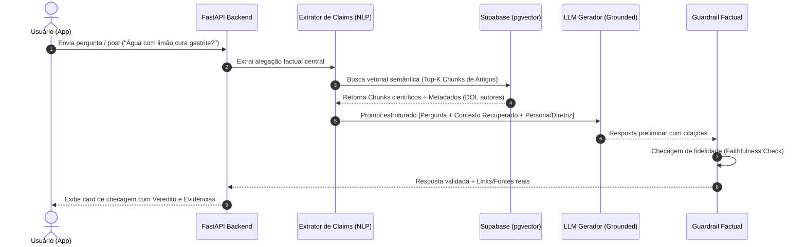

# Arquitetura de NLP e Abordagem RAG Anti-Alucinação

> **Referência:** GQ-Model 2  
> **Responsável:** Ana Luiza Hoffmann Ferreira  
> **Status:** Em desenvolvimento  

---

## 1. Visão Geral da Arquitetura RAG

Para garantir que as respostas sejam estritamente embasadas em evidências científicas e erradicar alucinações (como inventar artigos fictícios ou dados estatísticos incorretos), adotamos o padrão **Retrieval-Augmented Generation (RAG)** com verificação factual em duas etapas.



---

## 2. Componentes Técnicos

### 2.1. Modelos de Embeddings

**Escolhido: `intfloat/multilingual-e5-base`** — 768 dimensões, open source, executado localmente. Bom desempenho semântico em português acadêmico, sem custo por requisição e sem enviar o conteúdo dos artigos para terceiros. A coluna `chunks.embedding` acompanha essa dimensão (ver [Docs/Data/02](../Data/02_armazenamento_e_estrutura.md)).

Alternativas consideradas:

1. **`text-embedding-3-small` (OpenAI):** 1536 dimensões, excelente suporte multilíngue e baixo custo por requisição — descartado por depender de chave de API e de envio do conteúdo para um terceiro.
2. **`bge-m3`:** 1024 dimensões, open source, forte em textos longos — alternativa direta caso a qualidade do e5-base se mostre insuficiente na avaliação.

### 2.2. Modelo Gerador (LLM)
* **Modelos candidatos:** Gemini 1.5 Flash / GPT-4o-mini / Llama-3.1-8B-Instruct.
* **Critério de seleção:** Baixa latência (< 1.5s), alta aderência a instruções de *system prompt* e capacidade de produzir citações exatas em formato JSON/Markdown.

---

## 3. Estratégias Rigorosas Anti-Alucinação

1. **Restrição de Conhecimento Externo (*Strict Grounding*):**
   * O System Prompt instrui o modelo a responder **unicamente** com base no contexto fornecido no bloco `<contexto_cientifico>`.
   * Se o contexto recuperado não contiver informações suficientes, o modelo é forçado a responder:  
     *"Com base nos estudos científicos consultados na nossa base até o momento, não há evidências conclusivas para sustentar ou refutar essa alegação."*
2. **Citação Obrigatória de Fontes com ID:**
   * Toda frase que afirma um fato biológico/nutricional deve conter a marcação da fonte recuperada `[Ref: ID_CHUNK]`.
3. **Chain-of-Thought Oculto (Raciocínio Passo a Passo):**
   * O modelo gera internamente uma verificação antes de redigir o texto final:
     - *Passo 1: Qual é a alegação central?*
     - *Passo 2: O que diz o chunk 1? E o chunk 2?*
     - *Passo 3: Há contradição? Há evidência conclusiva ou apenas teste em animais/in vitro?*
     - *Passo 4: Formular a resposta amigável e desmistificadora.*

---

## 4. Template do System Prompt (RAG)

```text
Você é um assistente científico e acolhedor especializado em desmistificar mitos nutricionais e combater o terrorismo alimentar.

DIRETRIZES FUNDAMENTAIS:
1. Baseie sua resposta EXCLUSIVAMENTE nos fragmentos de artigos fornecidos em <contexto_cientifico>.
2. NUNCA invente referências, autores, anos ou resultados que não estejam explicitamente no texto.
3. Se a informação não estiver no contexto, declare explicitamente que a base atual não possui evidências suficientes.
4. Mantenha um tom empático, encorajador e livre de culpabilização alimentar.
5. Sempre cite a fonte ao final utilizando os metadados do contexto.

<contexto_cientifico>
{contextos_recuperados}
</contexto_cientifico>
```

---

## 5. Próximos Passos
- [ ] Implementar o pipeline inicial com LangChain / LlamaIndex ou código nativo Python assíncrono.
