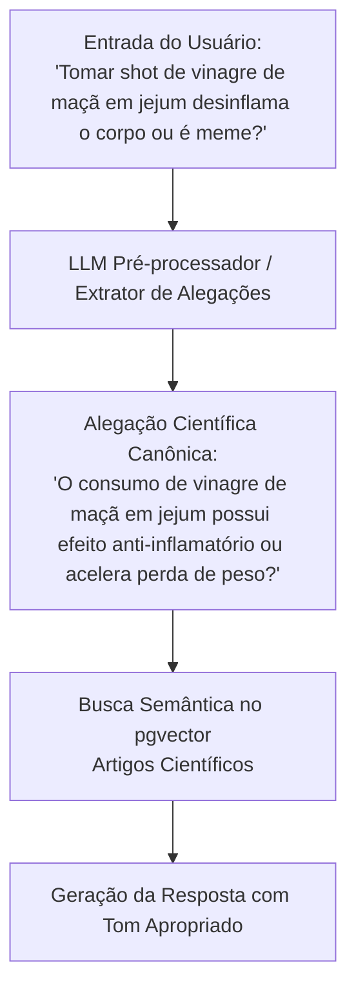

# Processamento de Linguagem da Internet (Sarcasmo, Gírias e Formatos)

> **Referência:** GQ-Model 3  
> **Responsável:** Ana Luiza Hoffmann Ferreira  
> **Status:** Em desenvolvimento  

---

## 1. O Desafio da Linguagem Informal em Redes Sociais

Muitas alegações sobre nutrição em redes sociais não vêm redigidas como afirmações científicas formais.
* **Gírias e Jargões do Fitness/Dietas:** *"secar a barriga"*, *"chutar o balde"*, *"veneno branco"* (açúcar/sal), *"dieta do ovo"*, *"reset metabólico"*, *"água com gratidão"*, *"inflamar o corpo"*.
* **Sarcasmo e Ironia:** *"Nossa, com certeza uma maçã à noite vai te engordar 5kg instantly 🙄"*.
* **Alegações Implícitas em Vídeos/Links:** O post não tem texto explícito, apenas a legenda *"Segredo que os médicos escondem de você 🤫👇"*.

---

## 2. Pipeline de Normalização e Extração de Claims

Para não realizar a busca vetorial (RAG) diretamente sobre uma frase sarcástica ou cheia de gírias (o que degradaria a similaridade de cosseno com artigos acadêmicos formais), utilizamos uma etapa intermediária de **Claim Extraction & Translation**:



---

## 3. Exemplos de Few-Shot Prompting para o Extrator

Abaixo está o conjunto de exemplos (*Few-Shot*) para instruir o modelo a converter posts informais em dúvidas canônicas:

```json
[
  {
    "input_raw": "Gente, cortar o carboidrato depois das 18h emagrece mesmo ou é fake?",
    "sentiment": "duvida_genuina",
    "is_sarcastic": false,
    "canonical_claim": "A restrição de ingestão de carboidratos no período noturno promove maior perda de peso do que o balanço calórico diário total?",
    "risk_level": "baixo"
  },
  {
    "input_raw": "Claro, coma 1kg de bolo fit com açúcar mascavo que você não vai engordar nada kkkkk 🤡",
    "sentiment": "sarcasmo",
    "is_sarcastic": true,
    "canonical_claim": "Alimentos considerados 'fit' ou com substitutos de açúcar (como açúcar mascavo) possuem valor calórico que contribui para o ganho de peso se consumidos em excesso?",
    "risk_level": "baixo"
  },
  {
    "input_raw": "Fiz jejum de água de 5 dias e curei minha diabetes! Não usem remédios!",
    "sentiment": "afirmacao_perigosa",
    "is_sarcastic": false,
    "canonical_claim": "Jejum prolongado de água cura diabetes mellitus e substitui tratamento farmacológico?",
    "risk_level": "critico"
  }
]
```

---

## 4. Tratamento de Formatos Especiais (Links e Imagens)

1. **Links de Redes Sociais (Instagram/TikTok/YouTube):**
   * Extrair a transcrição do áudio (via Whisper ou APIs públicas) ou o texto da legenda.
   * Passar o texto consolidado pelo Extrator de Claims.
2. **Prints de Conversas / Infográficos:**
   * Utilizar OCR para converter texto visual em string antes da extração de alegações.

---

## 5. Próximos Passos
- [ ] Criar um dicionário inicial de gírias e equivalentes biomédicos (*Glossário de Mitos Nutricionais*).
- [ ] Testar prompt de desambiguação de sarcasmo com uma bateria de 20 exemplos populares de redes sociais.
