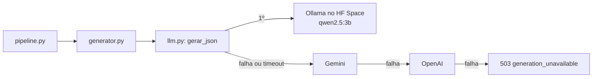

# LLM Próprio com Ollama e Provedores de Reserva

> **Referência:** GQ-Model 2 e GQ-Production 1
> **Status:** Implementado na branch `feat/llm-ollama` (Space a publicar)

---

## 1. Problema

Na versão anterior, a geração da resposta humanizada dependia só de chamadas ao Google Gemini (`APP/model/generator.py`). Sem a chave configurada, ou com a cota esgotada, o `/check-claim` respondia `503`. Essa dependência trazia quatro problemas:

| Problema | Impacto |
| :--- | :--- |
| **Privacidade (LGPD)** | No plano gratuito, o Google pode usar os prompts para melhorar seus produtos. O perfil do usuário contém condições clínicas, que são dado pessoal sensível (Art. 5º, II). |
| **Reprodutibilidade** | Nomes como `gemini-flash-latest` mudam de modelo sem nenhum commit. Uma queda de qualidade no benchmark deixa de ter uma causa rastreável. |
| **Ponto único de falha** | Cota por minuto e por dia; uma demonstração com a turma inteira pode esgotá-la. |
| **Defesa acadêmica** | A etapa que decide o veredito ficava em um modelo fechado, sem versão exata nem possibilidade de reprodução. |

---

## 2. Decisão

**Modelo principal aberto e hospedado pelo time (Ollama + `qwen2.5:3b`), com Gemini e OpenAI como reservas automáticas.**

| Critério | Ollama próprio | Gemini (gratuito) |
| :--- | :--- | :--- |
| Custo | Zero (Hugging Face Spaces, CPU basic) | Zero, com cota |
| Dado de saúde | Fica sob controle do time | Pode ser usado para treino |
| Versão do modelo | Fixa (tag do Ollama) | Pode mudar sem aviso |
| Latência | 20 a 60 s (CPU) | ~2 s |
| Qualidade do texto | Boa para 3B em pt-BR | Superior |

A combinação preserva as vantagens dos dois lados: o modelo próprio é o que o time apresenta e avalia, e o Gemini evita que a lentidão ou a hibernação do Space derrubem o serviço.

### 2.1. Escolha do modelo

| Modelo | Tamanho | Observação |
| :--- | :--- | :--- |
| **`qwen2.5:3b`** (escolhido) | ~1,9 GB | Melhor equilíbrio entre português, respeito ao formato JSON e velocidade em CPU |
| `gemma3:4b` | ~3,3 GB | Texto mais natural, cerca de 40% mais lento |
| `llama3.2:3b` | ~2,0 GB | Português um pouco inferior |

Modelos de 7B ou mais passam de 1 minuto por resposta nas 2 vCPUs gratuitas. No outro extremo, o `qwen2.5:0.5b`, usado apenas para validar o build, contradisse o contexto científico fornecido (afirmou que água com limão "queima gordura" com `risk_score` 0,0): **modelos abaixo de 3B não servem para este domínio.**

---

## 3. Arquitetura



### 3.1. Um cliente só para todos os provedores

Ollama, Gemini, OpenAI, Groq e OpenRouter expõem a mesma API de chat no formato da OpenAI (`POST <base_url>/chat/completions`). O módulo `APP/model/llm.py` implementa um único cliente para esse formato:

* **`Provedor`:** nome, URL, modelo, chave, tempo limite e se pode receber dado sensível.
* **`provedores_configurados(settings)`:** monta a cadeia a partir do `.env`, sempre na ordem Ollama → Gemini → OpenAI. Provedor sem variável configurada fica de fora.
* **`gerar_json(...)`:** tenta cada provedor em ordem e passa ao próximo em caso de erro HTTP, timeout, falha de conexão (Space hibernando) ou JSON inválido.

Trocar de provedor, ou incluir um novo compatível como o Groq, é uma mudança de configuração e não de código. O `model_version` da resposta e do log registra quem respondeu (ex.: `ollama/qwen2.5:3b` ou `gemini/gemini-3.5-flash-lite`), o que permite comparar os provedores com os registros de uso real.

### 3.2. Regra de privacidade

Chamadas marcadas com `dados_sensiveis=True` só são enviadas a provedores com `aceita_dados_sensiveis`, ou seja, apenas ao modelo próprio. Se ele falhar, a API responde `503` em vez de enviar o dado para fora.

Hoje o pipeline ainda não insere o perfil de saúde no prompt. Quando inserir, basta passar `dados_sensiveis=True` para `gerar_resposta_grounded`.

---

## 4. Hospedagem: Hugging Face Spaces

Os arquivos ficam em `deploy/ollama-space/`:

* **`Dockerfile`:** imagem oficial do Ollama com o modelo baixado durante o build, para o Space iniciar sem download. Configurações relevantes:
    * `OLLAMA_CONTEXT_LENGTH=8192`: o padrão do Ollama corta prompts longos em silêncio, e o prompt do RAG (instruções + fragmentos) ultrapassa facilmente 2 mil tokens;
    * `OLLAMA_KEEP_ALIVE=-1`: mantém o modelo na memória entre as perguntas;
    * `OLLAMA_NUM_PARALLEL=1`: uma geração por vez, adequado às 2 vCPUs;
    * execução com o uid 1000, exigido pelo Spaces.
* **`README.md`:** cabeçalho de configuração do Space e passo a passo de publicação.

O Space deve ser **privado**, de preferência dentro de uma **organização do Hugging Face** do grupo. O Ollama não tem autenticação; no Space privado, o próprio Hugging Face exige um token no header `Authorization: Bearer`, o mesmo header que o cliente já envia. Com o Space na organização, o token de leitura de qualquer membro funciona.

### 4.1. Configuração da API

```env
LLM_BASE_URL=https://<organizacao>-claudinho-llm.hf.space/v1
LLM_MODELO=qwen2.5:3b
LLM_API_KEY=hf_...          # token de leitura do Hugging Face
LLM_TIMEOUT_S=90

GEMINI_API_KEY=...          # reserva (opcional)
GEMINI_MODELO=gemini-3.5-flash-lite
```

---

## 5. Correções feitas junto

| Correção | Motivo |
| :--- | :--- |
| Rate limit do `/check-claim` restaurado | Havia sido removido na `feat/model`; 6 testes falhavam. Com um LLM próprio de capacidade limitada, sem limite, uma única pessoa ocuparia o Space. |
| Rota do `/check-claim` síncrona (`def`) | Como `async def`, a espera pelos embeddings e pelo LLM bloqueava o *event loop*: durante uma geração de 30 s, a API inteira parava, inclusive o `/health`. O FastAPI executa rotas síncronas em um *threadpool*. |
| `latency_ms` mede o pipeline completo | Era calculado antes da geração e saía sempre perto de 0 ms, o que inviabilizava comparar a latência dos provedores. |
| Cache do client do Supabase limpo entre testes | O teste que verifica que o import não cria o client falhava dependendo da ordem da suíte. |
| `httpx` em `requirements.txt` | É usado em produção e só constava nas dependências de desenvolvimento. |

---

## 6. Verificação

* Suíte completa: **110 testes passando** (antes: 7 falhando na `feat/model`); `ruff` e `black` sem apontamentos.
* `tests/test_llm.py` cobre: ordem da cadeia, formato da requisição, queda para a reserva em cada tipo de falha, JSON dentro de cerca de código, bloqueio de dado sensível para provedores externos e conversão da falha total em `503`.
* A imagem do Space foi construída e executada localmente com o uid 1000; o cliente obteve do Ollama o JSON `{answer, risk_score}` esperado.

---

## 7. Limitações e Próximos Passos

* **Latência:** de 20 a 60 s por resposta em CPU gratuita. Aceitável para o MVP; um cache semântico reduziria o impacto.
* **Hibernação:** o Space hiberna após 48 h sem uso. Antes de uma apresentação, fazer uma requisição para acordá-lo.
* **Concorrência:** uma geração por vez; com várias pessoas usando simultaneamente, as requisições excedem o tempo limite e caem na reserva.
* **Versão da imagem:** o `Dockerfile` usa `ollama/ollama:latest`; fixar a tag após o primeiro build bem-sucedido.
* **Benchmark comparativo:** executar `benchmarks/avaliar_pipeline.py` com o Ollama e com o Gemini e registrar fidelidade às fontes, acerto de veredito e latência de cada um. Esse é o dado que sustenta a decisão da seção 2.
