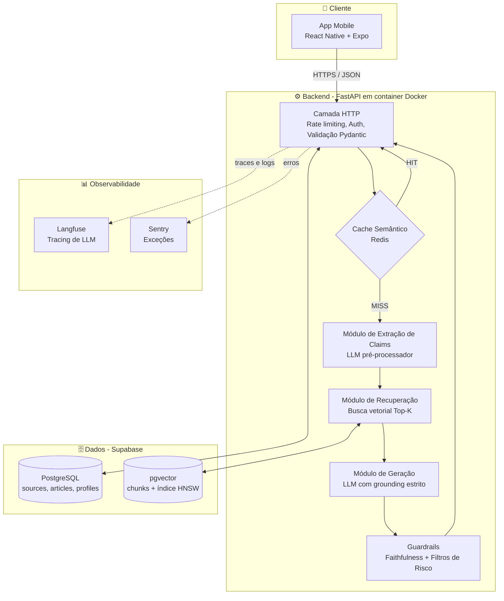
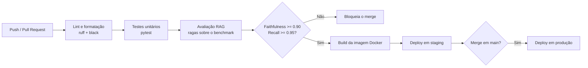

# Plataforma e Estratégia de Deploy

> **Referência:** GQ-Production 1
> **Responsável:** João Pedro Araújo de Freitas Lyra
> **Status:** Respondido

---

## 1. Arquitetura Geral da Aplicação

Para o MVP do Challenge 1, a arquitetura é orientada a um **monólito modular servido como API REST**, e não a microsserviços. A justificativa é o escopo e o prazo do desafio: com um time de 5 pessoas e 8 semanas, a sobrecarga operacional de orquestrar múltiplos serviços (service discovery, deploy independente, observabilidade distribuída) não se paga. O backend é único, mas internamente dividido em módulos com fronteiras claras (`ingestion`, `retrieval`, `generation`, `guardrails`, `feedback`), o que permite extrair qualquer um deles para um serviço próprio caso o produto escale depois do MVP.

A aplicação é entregue como **aplicativo mobile** (decisão da frente de Usuário), que consome a API por HTTPS. Toda a inteligência fica no servidor: o app é apenas a camada de apresentação e captura de entrada (texto, link ou print).



### 1.1. Fluxo de uma requisição de checagem

1. O app envia a dúvida do usuário (texto livre, URL de post ou imagem para OCR).
2. A camada HTTP valida o payload, aplica *rate limiting* e resolve a identidade do usuário.
3. O **cache semântico** verifica se uma pergunta equivalente já foi respondida (ver [03_escalabilidade_e_desempenho.md](./03_escalabilidade_e_desempenho.md)). Se sim, devolve a resposta armazenada.
4. Em caso de *miss*, o extrator converte a linguagem informal em uma alegação canônica (ver [Model/03](../Model/03_processamento_linguagem_internet.md)).
5. A alegação é vetorizada e usada na busca por similaridade no `pgvector`, retornando os Top-K fragmentos científicos.
6. O gerador produz a resposta ancorada exclusivamente nesses fragmentos.
7. Os *guardrails* checam fidelidade ao contexto e aplicam os filtros de grupos de risco (ver [Ethics/02](../Ethics/02_grupos_de_risco_e_filtros.md)) antes de liberar a resposta.
8. Toda a execução é registrada com `trace_id` para auditoria e para o *feedback loop*.

---

## 2. Especificação dos Endpoints REST da API

Base URL: `https://api.<dominio>/api/v1`
Formato: JSON (`application/json`) · Autenticação: `Authorization: Bearer <JWT do Supabase Auth>`

| Método | Rota | Autenticação | Descrição |
| :--- | :--- | :--- | :--- |
| `POST` | `/check-claim` | Obrigatória | Endpoint principal. Recebe a dúvida e devolve o veredito com evidências. |
| `POST` | `/feedback` | Obrigatória | Registra a avaliação do usuário sobre uma resposta (👍 / 👎 / reporte). |
| `GET` | `/profile` | Obrigatória | Retorna o perfil de saúde do usuário. |
| `PUT` | `/profile` | Obrigatória | Cria ou atualiza o perfil (usado pelos filtros de grupo de risco). |
| `GET` | `/health` | Pública | *Liveness probe* para o provedor de hospedagem e o CI/CD. |

---

### 2.1. `POST /api/v1/check-claim`

Aceita três modos de entrada mutuamente complementares: texto puro, URL de post ou imagem em base64 (print/infográfico, processado via OCR).

**Requisição**

```json
{
  "input_type": "text",
  "text": "vi no insta que água com limão em jejum desincha e queima gordura, é verdade?",
  "url": null,
  "image_base64": null,
  "use_profile": true
}
```

**Resposta — `200 OK`**

```json
{
  "trace_id": "7c1f2a90-3e4b-4d21-9f10-0b2a5c8e4d33",
  "canonical_claim": "O consumo de água com limão em jejum possui efeito termogênico ou de redução de retenção hídrica?",
  "verdict": "desinformacao",
  "risk_score": 0.78,
  "risk_level": "baixo",
  "answer": "Não há evidência de que água com limão acelere a queima de gordura. O efeito de 'desinchar' relatado costuma vir da hidratação em si [Ref: chunk_a1f2]...",
  "sources": [
    {
      "chunk_id": "chunk_a1f2",
      "title": "Efeitos metabólicos de compostos cítricos: revisão sistemática",
      "authors": "Silva, R.; Almeida, C.",
      "journal": "Revista de Nutrição",
      "published_at": "2021-06-01",
      "doi": "10.1590/xxxx-xxxx",
      "excerpt": "Não foram observadas diferenças significativas no gasto energético..."
    }
  ],
  "disclaimer": "Esta informação não substitui a consulta com um nutricionista ou médico...",
  "cached": false,
  "latency_ms": 2870,
  "model_version": "gpt-4o-mini@2024-07-18",
  "prompt_version": "v1.3"
}
```

**Campo `verdict`** — deriva diretamente da calibração de *threshold* definida pela frente de Modelo (limiares 0.35 e 0.65):

| Valor | Faixa de `risk_score` | Significado |
| :--- | :--- | :--- |
| `seguro` | `< 0.35` | Consenso científico favorável à alegação. |
| `cautela` | `0.35 – 0.65` | Evidência inconclusiva ou contexto dependente. |
| `desinformacao` | `> 0.65` | Mito identificado ou prática nociva. |
| `sem_evidencia` | — | A base RAG não retornou contexto suficiente (ver seção de drift). |
| `recusa_segura` | — | Bloqueado por *guardrail* de risco (ver [Ethics/01](../Ethics/01_seguranca_e_anti_alucinacao.md)). |

**Códigos de erro**

| Código | Situação | Corpo |
| :--- | :--- | :--- |
| `400` | Payload inválido ou nenhum campo de entrada preenchido | `{"error": "invalid_input", "detail": "..."}` |
| `401` | Token ausente ou expirado | `{"error": "unauthorized"}` |
| `413` | Imagem acima de 5 MB | `{"error": "payload_too_large"}` |
| `429` | Limite de requisições excedido | `{"error": "rate_limited", "retry_after": 42}` |
| `503` | Provedor de LLM indisponível | `{"error": "upstream_unavailable"}` |

---

### 2.2. `POST /api/v1/feedback`

Alimenta a base de re-anotação descrita em [02_monitoramento_e_mlops.md](./02_monitoramento_e_mlops.md). O `trace_id` amarra o feedback à execução exata (prompt, chunks recuperados, versão do modelo).

**Requisição**

```json
{
  "trace_id": "7c1f2a90-3e4b-4d21-9f10-0b2a5c8e4d33",
  "rating": "down",
  "reason": "fonte_irrelevante",
  "comment": "a resposta não falou sobre gastrite, que era a minha dúvida"
}
```

Valores aceitos em `reason`: `fonte_irrelevante`, `resposta_confusa`, `parece_errado`, `tom_julgador`, `nao_respondeu`, `outro`.

**Resposta — `201 Created`**: `{"status": "registered", "feedback_id": "..."}`

---

### 2.3. `GET` / `PUT /api/v1/profile`

Expõe os campos definidos pela frente de Dados (sexo, altura, peso, doenças, idade, restrições alimentares, rotina). O perfil é opcional, mas quando preenchido é o que aciona os filtros de proteção a grupos vulneráveis.

```json
{
  "sex": "F",
  "birth_date": "2003-04-12",
  "height_cm": 165,
  "weight_kg": 60,
  "conditions": ["diabetes_tipo_1"],
  "dietary_restrictions": ["lactose"],
  "routine": "sedentaria",
  "consent_health_data": true
}
```

> **LGPD:** dados de saúde são dados pessoais sensíveis (Art. 5º, II). O campo `consent_health_data` registra o consentimento explícito, e o `PUT` só persiste condições clínicas quando ele for `true`. O endpoint `DELETE /profile` (exclusão total) fica previsto para a versão pós-MVP.

---

## 3. Estratégia de Deploy do MVP

| Componente | Provedor Hospedado | Justificativa |
|:-------------------------|:---------------------------------|:-----------------------------------------------------------|
| **Backend API** | Render (ou Fly.io) — container Docker | Deploy direto do Dockerfile, HTTPS e domínio automáticos, camada gratuita suficiente para o volume do MVP, sem custo de configuração de infraestrutura |
| **Banco de Dados & RAG** | Supabase (PostgreSQL + pgvector) | Gerenciado, backup automático, excelente suporte a vetores |
| **Frontend** | Expo (React Native) + Expo EAS | Build e distribuição para Android/iOS sem manter duas bases de código; `expo-dev-client` permite testes com a turma sem publicar nas lojas |
| **Cache Semântico** | Upstash Redis (serverless) | Cobrança por requisição, camada gratuita, latência baixa |
| **Observabilidade** | Langfuse Cloud + Sentry | Camadas gratuitas cobrem o volume do MVP |

### 3.1. Ambientes

| Ambiente | Origem | Base de dados | Uso |
| :--- | :--- | :--- | :--- |
| `local` | Docker Compose na máquina do dev | Supabase local / seed reduzido | Desenvolvimento |
| `staging` | Branch `develop` | Projeto Supabase separado | Testes de integração e avaliação RAGAS |
| `production` | Branch `main` | Projeto Supabase de produção | Demo e apresentação final |

### 3.2. Esteira de CI/CD (GitHub Actions)



O ponto central da esteira é o **quality gate de avaliação**: nenhuma alteração em prompt, modelo ou estratégia de *chunking* chega à produção sem passar pelo conjunto de validação com as métricas mínimas definidas em [Model/01](../Model/01_metricas_e_avaliacao.md). Isso transforma a qualidade do RAG em um critério objetivo de deploy, e não em avaliação subjetiva a cada mudança.

### 3.3. Gestão de segredos

Chaves de API (LLM, Supabase `service_role`, Langfuse) ficam exclusivamente em variáveis de ambiente do provedor e em *GitHub Secrets*. O `.gitignore` do repositório já bloqueia `.env`, e o app mobile nunca recebe chave de LLM — todas as chamadas passam pelo backend.

---

## 4. Próximos Passos

- [ ] Subir o esqueleto do FastAPI com `/health` e `/check-claim` retornando resposta mockada, para desbloquear a integração do app.
- [ ] Escrever o `Dockerfile` e o `docker-compose.yml` do ambiente local.
- [ ] Configurar o workflow do GitHub Actions com lint e testes (o gate de RAGAS entra depois que o benchmark de 50 perguntas existir).
- [ ] Validar com a frente de Ética o texto exato do campo `disclaimer` retornado pela API.
