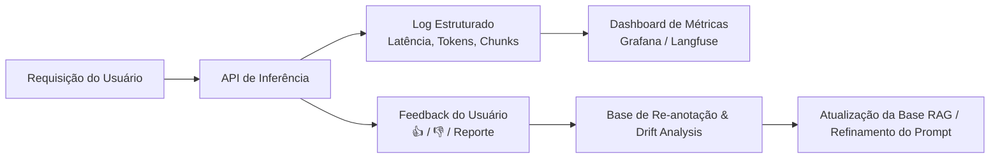
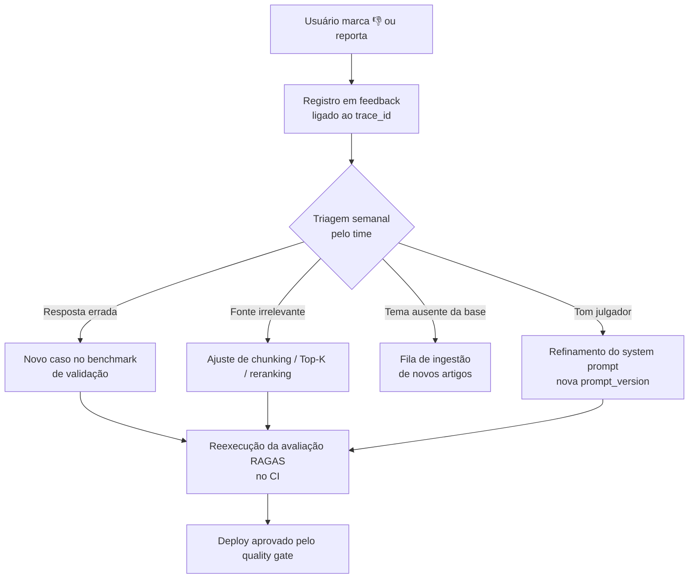

# Monitoramento e MLOps em Produção

> **Referência:** GQ-Production 2
> **Responsável:** João Pedro Araújo de Freitas Lyra
> **Status:** Respondido

---

## 1. Estratégia de Monitoramento Contínuo

Sistemas de Machine Learning em produção sujeitam-se a variações no comportamento do usuário e degradação da qualidade das respostas. No contexto de nutrição, novos boatos e dietas da moda surgem semanalmente nas redes sociais.



Uma observação importante sobre a natureza deste sistema: como a solução é baseada em **RAG e não em um classificador treinado por nós**, "atualizar o modelo" quase nunca significa retreinar pesos. Significa, na prática, três coisas: **(a)** ingerir novos artigos científicos na base vetorial, **(b)** versionar o *system prompt* e **(c)** trocar ou recalibrar o LLM gerador. O monitoramento é desenhado para indicar qual dessas três alavancas puxar.

---

## 2. Tipos de Drift a Monitorar

### 2.1. Data Drift / Covariate Shift (Surgimento de Novos Termos)
* **Sintoma:** O usuário envia perguntas sobre um novo termo ou substância que não existe na base de artigos.
* **Detecção:**
  * **Sinal primário — cobertura de recuperação.** Para cada consulta registramos a **similaridade de cosseno máxima** entre a alegação canônica e os chunks recuperados. Consultas com $\text{sim}_{max} < 0{,}75$ são marcadas como `low_coverage`. Se a média móvel de 7 dias dessa taxa ultrapassar **15%** das requisições, dispara alerta.
  * **Sinal secundário — agrupamento de lacunas.** Semanalmente, as consultas `low_coverage` são vetorizadas e agrupadas (HDBSCAN sobre os embeddings). Clusters com 10 ou mais consultas indicam um tema emergente concreto — é o "novo mito da semana" ganhando volume.
  * **Sinal terciário — vocabulário novo.** Comparação da distribuição de n-gramas da semana contra a janela de referência (primeiras 4 semanas de operação), sinalizando termos com crescimento abrupto de frequência.
  * **Sinal de negócio.** Aumento na proporção de vereditos `sem_evidencia`, que é a manifestação visível ao usuário do mesmo problema.
* **Ação:** Alerta automático no canal de dados para ingestão de novos artigos científicos sobre o tema em alta.

### 2.2. Concept Drift (Mudança no Consenso Científico)
* **Sintoma:** Novos consensos da OMS ou Ministério da Saúde sobre ingredientes (ex: adoçante aspartame).
* **Detecção:** diferente do *data drift*, este não aparece nos logs de uso — os usuários continuam perguntando normalmente e o sistema continua respondendo com confiança. A detecção é **externa e periódica**: revisão mensal de atualizações do Guia Alimentar para a População Brasileira, notas técnicas da ANVISA e posicionamentos da OMS/SBAN, complementada por uma revisão trimestral das alegações mais consultadas confrontadas com a literatura recente.
* **Ação:** Versionamento de artigos na tabela `articles` com data de vigência e tags de atualização.

### 2.3. Drift de Qualidade (Degradação Silenciosa)
* **Sintoma:** A taxa de 👎 sobe sem que a cobertura de recuperação tenha piorado — sinal de que o gerador está pior (mudança de versão do modelo pelo provedor, prompt alterado, chunks recuperados ficando menos relevantes).
* **Detecção:** monitoramento da taxa de feedback negativo por versão de prompt e de modelo, com execução semanal do conjunto de avaliação RAGAS em *staging* para comparação contra a linha de base.
* **Ação:** *rollback* para a versão anterior do prompt (versionada em Git) e abertura de investigação.

---

## 3. Estrutura de Logs de Inferência (JSON Estruturado)

Cada requisição gera **um único registro estruturado**, escrito em `stdout` (coletado pelo provedor) e enviado ao Langfuse. O `trace_id` é a chave que costura log, feedback do usuário e auditoria posterior.

```json
{
  "trace_id": "7c1f2a90-3e4b-4d21-9f10-0b2a5c8e4d33",
  "timestamp": "2025-09-23T14:32:07.482Z",
  "user_id_hash": "sha256:9f2b...",
  "endpoint": "/api/v1/check-claim",

  "input": {
    "input_type": "text",
    "raw_length": 87,
    "language": "pt-BR"
  },

  "nlp": {
    "canonical_claim": "O consumo de água com limão em jejum possui efeito termogênico?",
    "is_sarcastic": false,
    "risk_level": "baixo"
  },

  "retrieval": {
    "top_k": 5,
    "chunk_ids": ["chunk_a1f2", "chunk_77bd", "chunk_0c31"],
    "similarity_max": 0.84,
    "similarity_mean": 0.79,
    "low_coverage": false,
    "vector_search_ms": 96
  },

  "generation": {
    "model_version": "gpt-4o-mini@2024-07-18",
    "prompt_version": "v1.3",
    "input_tokens": 3980,
    "output_tokens": 412,
    "cost_usd": 0.000844
  },

  "guardrails": {
    "faithfulness_check": "pass",
    "risk_group_filter": "not_triggered",
    "safe_refusal": false
  },

  "output": {
    "verdict": "desinformacao",
    "risk_score": 0.78,
    "sources_count": 3
  },

  "performance": {
    "cache_hit": false,
    "ttft_ms": 1240,
    "total_latency_ms": 2870
  },

  "status": "success",
  "error": null
}
```

### 3.1. Princípios de logging adotados

* **Nunca registrar dados de saúde em texto claro.** O `user_id` é hasheado e o perfil clínico jamais entra no log — apenas um booleano indicando se um filtro de grupo de risco foi acionado. Isso mantém os logs fora do escopo de dados sensíveis da LGPD.
* **Registrar os `chunk_ids`, não os textos.** Reduz o volume de log e permite reconstruir o contexto exato consultando o banco, o que é essencial para auditar uma resposta questionada.
* **Toda resposta carrega `model_version` e `prompt_version`.** Sem isso é impossível atribuir uma queda de qualidade à mudança que a causou.
* **Um registro por requisição, não vários.** Evita a necessidade de fazer *join* entre eventos parciais na hora de analisar.

### 3.2. Métricas derivadas e alertas

| Métrica | Fonte | Limiar de alerta |
| :--- | :--- | :--- |
| Taxa de erro 5xx | `status` | > 2% em 1h |
| Latência p95 | `total_latency_ms` | > 6 s em 1h |
| Taxa de `low_coverage` | `retrieval.low_coverage` | > 15% em 7 dias |
| Taxa de 👎 | `/feedback` | > 20% em 7 dias |
| Falhas de *faithfulness* | `guardrails` | > 5% em 24h |
| Custo diário | `generation.cost_usd` | > US$ 1,50/dia |

---

## 4. Feedback Loop e Re-anotação



Cada feedback negativo triado vira **um caso permanente no conjunto de validação**. É assim que o benchmark cresce a partir do uso real em vez de ficar congelado nas 50 perguntas iniciais, e é o que impede que uma correção futura reintroduza um erro já resolvido.

---

## 5. Versionamento de Código, Dados e Modelos

| Artefato | Como é versionado | Onde |
| :--- | :--- | :--- |
| **Código** | Git + *tags* semânticas (`v0.1.0`) | GitHub |
| **System prompt** | Arquivo versionado em Git (`prompts/system_v1.3.txt`), referenciado por `prompt_version` | GitHub |
| **Base RAG** | Coluna `ingested_at` + *snapshot* mensal do dump da tabela `chunks` | Supabase |
| **Artigos** | `published_at`, `collected_at` e tag de vigência em `metadata` | Supabase |
| **LLM gerador** | String fixa de versão do provedor gravada em cada log | Configuração de ambiente |
| **Resultados de avaliação** | CSV de execução do RAGAS versionado por *commit* | GitHub Actions |

> **Decisão:** fixar explicitamente a versão do modelo do provedor (ex.: `gpt-4o-mini@2024-07-18`) em vez de usar o *alias* móvel. Aliases mudam sem aviso e são uma fonte clássica de degradação silenciosa impossível de diagnosticar depois.

---

## 6. Rotina Operacional

| Frequência | Atividade |
| :--- | :--- |
| **Contínua** | Alertas automáticos (erro, latência, custo) via Sentry |
| **Semanal** | Triagem de feedbacks negativos; análise de clusters `low_coverage`; ingestão de artigos para os temas emergentes |
| **Mensal** | Execução completa do benchmark RAGAS; revisão de consenso científico; *snapshot* da base |
| **Trimestral** | Reavaliação do LLM gerador (custo x qualidade x latência) e revisão do *threshold* de decisão |

---

## 7. Ferramentas MLOps Recomendadas para o MVP

1. **Langfuse / OpenLLMetry:** Rastreamento (*tracing*) nativo de pipelines RAG (tempo por chunk, custo em dólares por query, visualização do prompt final).
2. **PostgreSQL Logs / Supabase Dashboard:** Monitoramento de tempo de execução de queries de índice HNSW.
3. **Sentry:** Captura de exceções e erros de conexão com provedores de LLM.
4. **GitHub Actions:** Execução do *quality gate* de avaliação (RAGAS) a cada Pull Request.
5. **Ragas:** Cálculo automatizado de *Faithfulness*, *Answer Relevance* e *Context Recall* sobre o conjunto de validação.

---

## 8. Próximos Passos

- [ ] Implementar o *middleware* de logging estruturado no FastAPI com geração de `trace_id`.
- [ ] Instrumentar o pipeline com o SDK do Langfuse.
- [ ] Criar a tabela `feedback` no Supabase, alinhada com a frente de Dados.
- [ ] Definir com a frente de Modelo o valor final do limiar de `low_coverage` (0,75 é uma estimativa inicial, a ser calibrada com dados reais).
