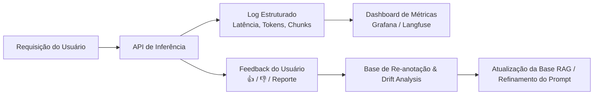

# Monitoramento e MLOps em Produção

> **Referência:** GQ-Production 2  
> **Responsável:** João Pedro Araújo de Freitas Lyra  
> **Status:** Em desenvolvimento  

---

## 1. Estratégia de Monitoramento Contínuo

Sistemas de Machine Learning em produção sujeitam-se a variações no comportamento do usuário e degradação da qualidade das respostas. No contexto de nutrição, novos boatos e dietas da moda surgem semanalmente nas redes sociais.

---

## 2. Tipos de Drift a Monitorar

### 2.1. Data Drift / Covariate Shift (Surgimento de Novos Termos)
* **Sintoma:** O usuário envia perguntas sobre um novo termo ou substância que não existe na base de artigos.
* **Detecção:** 
* **Ação:** Alerta automático no canal de dados para ingestão de novos artigos científicos sobre o tema em alta.

### 2.2. Concept Drift (Mudança no Consenso Científico)
* **Sintoma:** Novos consensos da OMS ou Ministério da Saúde sobre ingredientes (ex: adoçante aspartame).
* **Ação:** Versionamento de artigos na tabela `articles` com data de vigência e tags de atualização.

---

## 3. Estrutura de Logs de Inferência (JSON Estruturado)

---

## 4. Ferramentas MLOps Recomendadas para o MVP

1. **Langfuse / OpenLLMetry:** Rastreamento (*tracing*) nativo de pipelines RAG (tempo por chunk, custo em dólares por query, visualização do prompt final).
2. **PostgreSQL Logs / Supabase Dashboard:** Monitoramento de tempo de execução de queries de índice HNSW.
3. **Sentry:** Captura de exceções e erros de conexão com provedores de LLM.

---
