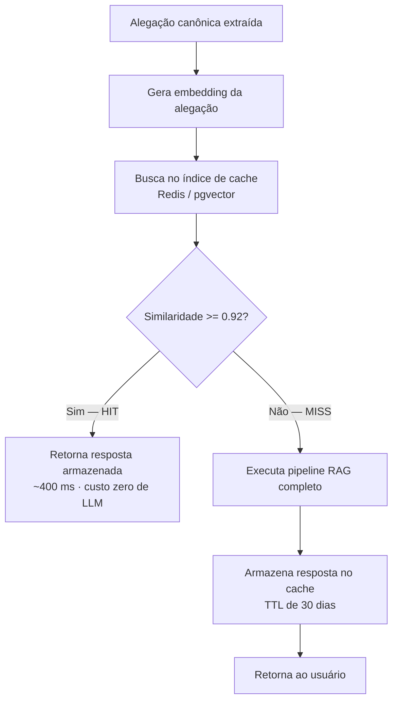

# Escalabilidade, Desempenho e Custos

> **Referência:** GQ-Production 3
> **Responsável:** João Pedro Araújo de Freitas Lyra
> **Status:** Respondido

---

## 1. Requisitos de Desempenho (SLAs)

Para garantir que o usuário não abandone o app durante a consulta de uma informação vista na rede social:

| Métrica de Desempenho | Meta MVP |
| :--- | :--- |
| **Tempo até o Primeiro Token (TTFT)** | < 1,5 s (p95) |
| **Latência Total da Resposta** | < 5 s (p95) · < 8 s (p99) |
| **Tempo de Busca no pgvector (HNSW)** | < 150 ms (p95) |
| **Disponibilidade (Uptime)** | 99% mensal (~7 h de indisponibilidade tolerada) |
| **Capacidade Simultânea** | 30 requisições concorrentes · ~200 usuários ativos/dia |

### 1.1. Justificativa dos números

O caso de uso é uma checagem rápida feita **com o celular na mão, no meio do feed**. A referência prática é o tempo de tolerância de leitura em interfaces móveis: acima de ~10 s o usuário abandona a tarefa. Por isso o TTFT é a métrica que mais importa: com **resposta em streaming**, o texto começa a aparecer em menos de 1,5 s e a percepção de espera cai drasticamente, ainda que a resposta completa leve 4 ou 5 segundos.

As metas de disponibilidade e concorrência são deliberadamente modestas: o MVP será usado por uma turma e por um grupo pequeno de usuários de validação. Perseguir 99,9% de uptime aqui seria otimização prematura — o que está em jogo nesta fase é validar o valor do produto, conforme a própria classificação desta GQ ("Se sobrar tempo").

### 1.2. Orçamento de latência (*latency budget*)

| Etapa | Tempo estimado |
| :--- | :--- |
| Rede + validação + autenticação | ~150 ms |
| Consulta ao cache semântico (embedding + Redis) | ~200 ms |
| Extração da alegação canônica (LLM pequeno) | ~600 ms |
| Embedding da alegação | ~150 ms |
| Busca vetorial HNSW no pgvector | ~100 ms |
| Geração da resposta (LLM, streaming até o fim) | ~2.500 ms |
| Guardrail de fidelidade | ~600 ms |
| **Total estimado (p95)** | **~4,3 s** |

O gargalo dominante é a **geração**, o que direciona todas as otimizações: reduzir chamadas ao LLM (cache), reduzir tokens de entrada (chunks menores e melhor selecionados) e mascarar o tempo restante (streaming).

### 1.3. Pior caso: cadeia de timeouts contra o teto da plataforma

O orçamento acima é o caso típico (p95). O pior caso é outro: Space do Ollama dormindo, os dois
provedores de reserva falhando em seguida, tudo **em série**. Os timeouts são independentes entre
si, então o pior caso é a soma deles:

| Etapa | Timeout | Onde |
| :--- | ---: | :--- |
| Embeddings (Space) | 20 s | `APP/config.py` — `embeddings_timeout_s` |
| Ollama (modelo próprio) | 90 s | `APP/config.py` — `llm_timeout_s` |
| Gemini (reserva 1) | 25 s | `APP/model/llm.py` — `TIMEOUT_EXTERNO_S` |
| OpenAI (reserva 2) | 25 s | `APP/model/llm.py` — `TIMEOUT_EXTERNO_S` |
| **Soma da cadeia** | **160 s** | |
| Fallback local (classificador de regras) | ~0 s | `APP/model/generator.py` — sem rede |
| **Teto da função (Hobby)** | **300 s** | `vercel.json` — `maxDuration` |
| **Margem** | **140 s** | |

A ordem importa: os 90 s do Ollama são gastos **antes** de a cadeia sequer tentar o Gemini, e o
fallback local só roda depois que os três falharam. É por isso que a margem precisa sobrar
inteira no fim — se a plataforma cortar antes, o cliente recebe um 504 da Vercel em vez do
fallback que foi escrito exatamente para esse caso.

O `maxDuration` era 180 s, contra os 160 s da cadeia: 20 s de margem, que o *cold start* do Ollama
consome sozinho. Subiu para 300 s, o máximo do plano Hobby (ver
[`01_plataforma_e_deploy.md`](01_plataforma_e_deploy.md), seção 3).

> **Ao mexer em qualquer um desses quatro valores, refaça a soma.** Eles moram em três arquivos
> diferentes e nada no código os liga entre si nem ao `maxDuration`.

**Medição de *cold start*** — número medido, não estimado. Reproduzir com
[`benchmarks/cold_start.py`](../../benchmarks/cold_start.py), com o Space comprovadamente frio:

| Medição | Valor | Data |
| :--- | ---: | :--- |
| Cadeia LLM até o fallback local (`--so-cadeia`) | **140,2 s** | 23/09/2026 |
| Primeira resposta do Ollama (Space frio) | *a medir* | — |
| Resposta do Ollama já quente (referência) | *a medir* | — |

Os 140,2 s são medidos, não somados: o `--so-cadeia` aponta os três provedores para um
servidor local que aceita a conexão e nunca responde, e deixa cada timeout estourar de
verdade. Confere com os 90 + 25 + 25 s esperados. Somando os 20 s de embeddings, o pior caso
do pipeline fica em ~160 s, contra os 300 s do teto: **140 s de margem**.

As duas linhas pendentes exigem o Space comprovadamente dormindo e não dá para forçar isso por
código — precisa do sleep manual na aba *Settings* do Space, ou ~48 h sem tráfego.

---

## 2. Estratégias de Otimização de Custo e Velocidade

### 2.1. Cache Semântico (*Semantic Caching*)
Muitos usuários farão variações da mesma pergunta popular (ex: *"Água com limão emagrece?"* vs *"Tomar água e limão de manhã queima gordura?"*).

Um cache tradicional por chave exata seria inútil aqui: as duas frases acima são strings diferentes e nunca colidiriam. A solução é armazenar o **embedding da alegação canônica** e considerar acerto quando a similaridade de cosseno com uma entrada existente ultrapassar um limiar.

**Parâmetros de projeto:**

| Parâmetro | Valor | Racional |
| :--- | :--- | :--- |
| Limiar de similaridade | 0,92 | Alto o bastante para não devolver resposta de uma pergunta parecida mas diferente — em saúde, um falso acerto de cache é um erro grave |
| TTL | 30 dias | Equilibra reaproveitamento com a necessidade de refletir atualizações da base científica |
| Invalidação | Manual | Ingestão de artigos sobre um tema invalida as entradas de cache daquele tema |
| Chave de cache | Alegação canônica, **não** o texto bruto | A normalização já elimina gírias e sarcasmo, elevando muito a taxa de acerto |
| Escopo | Somente respostas **sem personalização** | Respostas filtradas por perfil de saúde nunca são cacheadas nem servidas a outro usuário |

**Ganho esperado:** com a concentração típica de dúvidas em poucos mitos populares ("água com limão", "carboidrato à noite", "detox", "glúten"), a projeção é de **30% a 40% de acerto de cache** após as primeiras semanas — redução proporcional direta no custo de LLM e latência de ~4,3 s para ~0,4 s nesses casos.

### 2.2. Rate Limiting e Proteção contra Abusos
* Implementar limite de **requisições por minuto por IP/usuário** para prevenir _scraping_ abusivo e estouro de cota da API do modelo.

| Escopo | Limite | Motivo |
| :--- | :--- | :--- |
| Por usuário autenticado | 10 req/min · 100 req/dia | Uso humano legítimo raramente ultrapassa isso |
| Por IP (não autenticado, `/health`) | 30 req/min | Mitiga varredura automatizada |
| Global (circuit breaker de custo) | 2.000 req/dia | Trava de segurança: acima disso a API entra em modo degradado e responde apenas do cache, evitando estouro de orçamento |

Implementação com `slowapi` (FastAPI) usando Redis como contador, resposta `429` com cabeçalho `Retry-After`.

### 2.3. Demais otimizações

| Técnica | Efeito |
| :--- | :--- |
| **Streaming de resposta (SSE)** | Não reduz a latência total, mas derruba o TTFT percebido — a alavanca de maior impacto sobre a experiência |
| **Modelo pequeno na extração de claims** | A tarefa é simples e estruturada; usar o modelo caro em ambas as etapas dobraria o custo sem ganho |
| **Índice HNSW no `pgvector`** | Busca aproximada em tempo logarítmico; mantém a recuperação abaixo de 150 ms mesmo com centenas de milhares de chunks |
| **Top-K enxuto (K = 5)** | Cada chunk extra são ~500 tokens de entrada; K alto encarece e ainda dispersa a atenção do gerador |
| **Conexões assíncronas + pool** | FastAPI com `async` e `asyncpg` sustenta as 30 requisições concorrentes em uma única instância, já que a carga é I/O-bound (espera de rede pelo LLM), não CPU-bound |

---

## 3. Estimativa de Custos para o MVP

**Premissas:** 200 usuários ativos/dia · 3 consultas/usuário · **≈ 18.000 requisições/mês** · 35% de acerto de cache → **≈ 11.700 chamadas efetivas ao LLM**.

### 3.1. Custo unitário por requisição (cache *miss*)

| Item | Volume | Preço de referência | Custo |
| :--- | :--- | :--- | :--- |
| Embedding da alegação | ~30 tokens | US$ 0,02 / 1M | ~US$ 0,0000006 |
| Extração de claim (LLM pequeno) | 300 in / 80 out | US$ 0,15 / 0,60 por 1M | ~US$ 0,00009 |
| Geração RAG | 4.000 in / 400 out | US$ 0,15 / 0,60 por 1M | ~US$ 0,00084 |
| Guardrail de fidelidade | 1.200 in / 60 out | US$ 0,15 / 0,60 por 1M | ~US$ 0,00022 |
| **Total por requisição** | | | **≈ US$ 0,00115** |

### 3.2. Custo mensal consolidado

* **Embeddings:** carga inicial de ~1.000 artigos (~6M tokens) ≈ **US$ 0,12** (custo único); embeddings de consulta ≈ US$ 0,01/mês.
* **LLM:** 11.700 chamadas × US$ 0,00115 ≈ **US$ 13,50/mês**.
* **Hospedagem Supabase + Backend:** Camada gratuita (*Free Tier*).
* **Redis (Upstash), Langfuse, Sentry:** camadas gratuitas.
* **Custo Total Estimado do MVP:** **≈ US$ 14/mês (~R$ 75/mês)** — dentro do que o grupo consegue custear durante o desafio.

### 3.3. Sensibilidade e projeção

| Cenário | Requisições/mês | Custo estimado |
| :--- | :--- | :--- |
| Demo da apresentação (uso pontual) | ~1.000 | < US$ 1 |
| MVP validado (200 usuários/dia) | 18.000 | ~US$ 14 |
| Crescimento 10× (2.000 usuários/dia) | 180.000 | ~US$ 135 + saída do *free tier* do Supabase |

A partir do cenário de crescimento, três frentes passariam a se pagar: *reranking* para reduzir Top-K, embeddings open-source auto-hospedados (a RTX disponível no time cobriria a carga de indexação) e migração do gerador para um modelo aberto servido por provedor de inferência.

---

## 4. Próximos Passos

- [ ] Implementar o cache semântico com Redis e medir a taxa real de acerto na primeira semana de uso.
- [ ] Habilitar streaming (SSE) no endpoint `/check-claim` e validar o TTFT no app.
- [ ] Configurar `slowapi` com os limites definidos.
- [ ] Executar teste de carga com `locust` (30 usuários virtuais) para confirmar os SLAs antes da demo interna de 05/10.
