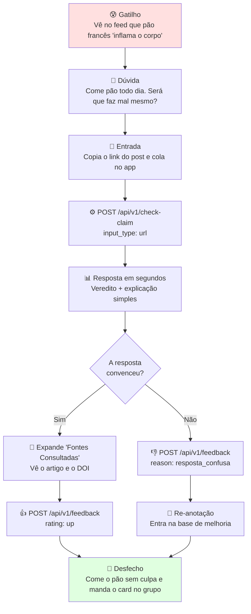

# Personas e Público-Alvo

> **Referência:** GQ-User 1  
> **Responsável:** Beatriz Brandão Fidelis Batista  
> **Status:** Respondido  

---

## 1. Definição do Público-Alvo

A resposta curta da [GQ-User 1](../GQ.md) é: *pessoas que querem melhorar a alimentação, e acompanhá-la, sem cair no terrorismo nutricional*. Essa frase precisa virar um recorte operável, porque é ela que decide quais personas o MVP atende, quais ele atende com proteção extra e quais ele simplesmente não atende.

O público não se define por quem *tem* uma dúvida nutricional, e sim por quem **esbarra em desinformação nutricional na internet e não tem como verificá-la sozinho**. A distinção importa: quem já tem acompanhamento profissional contínuo pergunta ao profissional, e quem tem formação na área vai direto à fonte primária. O vazio está no meio, e é ele que o produto ocupa.

### 1.1. Recorte primário

O MVP é desenhado para este perfil. É dele que sai a persona da seção 2.

| Critério | Valor |
| :--- | :--- |
| **Faixa etária** | 18 a 35 anos |
| **Localização** | Brasil, com prioridade em centros urbanos |
| **Comportamento digital** | Consome conteúdo de saúde e alimentação em redes sociais diariamente |
| **Relação com nutrição** | Sem acompanhamento profissional contínuo, por custo ou por falta de tempo |
| **Gatilho de uso** | Viu um post, vídeo ou mensagem que gerou dúvida ou medo |
| **Estado de saúde** | Sem condição clínica que exija dieta prescrita |

### 1.2. Recorte secundário

Pessoas com condição clínica crônica, gestantes, lactantes e pessoas em recuperação de transtorno alimentar seguem sendo público, por um motivo direto: são as mais expostas à desinformação nutricional e as que mais pagam caro por ela. O produto não as exclui, mas encaminha cada uma por um caminho de resposta próprio, definido em [Ethics/02](../Ethics/02_grupos_de_risco_e_filtros.md). São as personas da seção 3.

### 1.3. Fora do escopo do MVP

| Quem | Por quê |
| :--- | :--- |
| **Menores de 18 anos** | Consentimento para tratar dado de saúde exige responsável legal (LGPD, Art. 14), o que não cabe no prazo do desafio |
| **Profissionais buscando fonte primária** | Precisam da revisão sistemática inteira, não de uma resposta em linguagem simples |
| **Quem busca prescrição de dieta** | O produto **checa alegações**, não prescreve. Ver a política de recusa segura em [Ethics/01](../Ethics/01_seguranca_e_anti_alucinacao.md) |
| **Público não lusófono** | A base de evidências é de literatura científica brasileira (ver [Data/01](../Data/01_tipos_e_fontes_de_dados.md)) |

> **Fora do escopo não significa sem proteção.** A idade é autodeclarada e não há como verificá-la, então os filtros de *Ciclos de Vida Especiais* de [Ethics/02](../Ethics/02_grupos_de_risco_e_filtros.md), inclusive o de crianças e adolescentes, seguem valendo para qualquer consulta que aparente vir desse público. O recorte de escopo diz para quem o produto é desenhado e divulgado, não de quem ele se protege. É a mesma lógica da persona Camila, na seção 3.2.

---

## 2. Persona do MVP

### 🎯 Persona Principal: *Lucas, o Universitário Atarefado*

```
+-----------------------------------------------------------------------+
|  FOTO / AVATAR: Lucas, 22 anos, estudante universitário e estagiário  |
+-----------------------------------------------------------------------+
|  "Eu só queria saber se comer pão francês de manhã realmente faz mal   |
|   sem ter que ler um artigo de 20 páginas ou seguir uma dieta maluca" |
+-----------------------------------------------------------------------+
```

* **Perfil Demográfico:**
  * **Idade:** 22 anos
  * **Ocupação:** Estudante de graduação e estagiário em regime híbrido.
  * **Localização:** Brasília - DF.
  * **Renda:** 1 a 2 salários mínimos.
* **Comportamento & Rotina:**
  * Passa entre 2h e 4h diárias em redes sociais.
  * Tem rotina corrida, pouco tempo para cozinhar e orçamento limitado para alimentação.
  * Costuma pesquisar rapidamente no Google ou nas redes sociais sobre o que "pode" ou "não pode" comer.
* **Dores & Frustrações:**
  * Excesso de informações contraditórias nas redes (um influenciador diz que café prolonga a vida, outro diz que é tóxico).
  * Sensação de culpa ao comer alimentos normais e acessíveis (arroz, feijão, pão).
  * Dificuldade de pagar consultas frequentes com nutricionistas.
* **Necessidades & Objetivos:**
  * Uma ferramenta rápida e acessível para checar se uma informação vista na internet é verdade ou mito.
  * Explicações simples, mas respaldadas em fontes confiáveis.
  * Segurança de que não está caindo em ciladas prejudiciais à saúde.

### 2.1. Hábitos digitais

O perfil de uso do Lucas é o que define as restrições de produto da [User/02](./02_acesso_e_canais.md) e o SLA de latência da [Production/03](../Production/03_escalabilidade_e_desempenho.md).

| Hábito | Consequência para o produto |
| :--- | :--- |
| Descobre conteúdo pelo feed do Instagram e do TikTok, não por busca ativa | A dúvida nasce **dentro** de outro app. A entrada precisa aceitar link e print, não só texto digitado |
| Usa o celular em pé, no transporte, em sessões de 1 a 2 minutos | Resposta longa não é lida. O veredito tem que caber na primeira dobra da tela |
| Tem plano de dados limitado e celular Android intermediário | App leve, sem vídeo e sem processamento pesado no cliente (ver [Production/01](../Production/01_plataforma_e_deploy.md), seção 1) |
| Desconfia de propaganda disfarçada de conselho | Fonte e DOI visíveis são condição de confiança, não enfeite (ver [Ethics/03](../Ethics/03_transparencia_e_disclaimers.md)) |

### 2.2. O que o Lucas espera de uma resposta

1. **Um veredito antes da explicação.** Ele quer saber se é mito ou não antes de decidir se vai ler o resto.
2. **Linguagem de conversa.** "Não tem evidência de que isso queime gordura" funciona; "os achados são inconclusivos quanto ao efeito termogênico" não.
3. **A fonte à mão, sem ser obrigado a abrir.** O artigo fica numa seção expansível, não no meio do texto.
4. **Ausência de julgamento.** Nenhuma resposta pode sugerir que ele errou por comer algo. Essa é a diferença central frente ao conteúdo que ele encontra no feed.

---

## 3. Personas Secundárias

As quatro personas abaixo não são o alvo de aquisição do MVP, mas são **personas de segurança**: cada uma representa um caminho de resposta que precisa existir para que o produto não cause dano. As três primeiras estão mapeadas como grupo vulnerável em [Ethics/02](../Ethics/02_grupos_de_risco_e_filtros.md).

### 3.1. *Renata, 54 anos, convivendo com diabetes tipo 2*

É a secundária mais desenvolvida porque é a que exercita o caminho completo do produto: perfil de saúde preenchido, filtro de risco acionado e resposta condicionada à condição clínica.

```
+-----------------------------------------------------------------------+
|  FOTO / AVATAR: Renata, 54 anos, professora, diabetes tipo 2 há 6 anos |
+-----------------------------------------------------------------------+
|  "Minha cunhada jura que canela em pó controla a glicemia e que dá     |
|   para diminuir a metformina. Eu não sei se acredito, mas e se for?"   |
+-----------------------------------------------------------------------+
```

* **Perfil:** professora da rede pública, 54 anos, Goiânia - GO. Diagnóstico de diabetes tipo 2 há seis anos, em uso contínuo de medicação.
* **Relação com a informação:** recebe conteúdo principalmente por grupos de WhatsApp de família e igreja, onde a desinformação chega com credibilidade emprestada de quem enviou.
* **Dores:**
  * Recebe "receitas naturais" que prometem substituir a medicação.
  * Consulta com endocrinologista a cada seis meses, tempo demais para tirar dúvidas do dia a dia.
  * Tem medo de perguntar e parecer que está duvidando do médico.
* **O que ela precisa do produto:** uma checagem que leve a condição dela em conta, e que **nunca** dê a entender que algum alimento substitui tratamento.
* **Comportamento esperado do sistema:** com `conditions: ["diabetes_tipo_2"]` no perfil ([Production/01](../Production/01_plataforma_e_deploy.md), seção 2.3), a resposta passa pelo filtro de condição crônica e é acompanhada do encaminhamento a profissional. Alegações do tipo "substitua o remédio por X" caem em `recusa_segura`.

### 3.2. Fichas compactas

**🤰 *Juliana, 29 anos, gestante de 22 semanas***
> *"Cortei café, atum e queijo branco porque li num blog. Agora li que precisava do atum. Eu já não sei o que posso comer."*

* **Contexto:** primeira gestação, alto engajamento com conteúdo de maternidade nas redes.
* **Dor central:** a restrição por precaução vira restrição por pânico, e o resultado é uma dieta empobrecida justamente no período de maior demanda nutricional.
* **Comportamento esperado do sistema:** resposta com ressalva obrigatória para gestação e encaminhamento ao pré-natal, mesmo quando a alegação é verdadeira para a população geral.

**💚 *Camila, 24 anos, em tratamento de transtorno alimentar***
> *"Eu só queria saber quantas calorias tem isso. Por que o app não me responde?"*

* **Contexto:** em acompanhamento psiquiátrico e nutricional para anorexia nervosa, ainda ativa nas redes onde o conteúdo de restrição circula.
* **Dor central:** buscadores e LLMs genéricos respondem a qualquer pergunta sobre restrição calórica, e cada resposta alimenta o quadro.
* **Comportamento esperado do sistema:** é a persona que o produto atende **recusando**. Consultas com padrão de restrição ou contagem obsessiva acionam a recusa segura de [Ethics/01](../Ethics/01_seguranca_e_anti_alucinacao.md), com acolhimento e canal de ajuda no lugar do dado numérico.
* **Ponto em aberto:** a detecção depende de sinal textual, não de diagnóstico declarado. O perfil de saúde é opcional e uma pessoa nessa situação tende a não preenchê-lo. A frente de Ética precisa definir o gatilho por conteúdo da consulta.

**👨‍👦 *Marcos, 41 anos, cuidador do pai hipertenso***
> *"Meu pai tem 78 anos e pressão alta. Ele acredita em tudo que chega no WhatsApp e eu é que tenho que desmentir."*

* **Contexto:** pesquisa em nome de outra pessoa, com perfil de saúde que não é o dele.
* **Dor central:** precisa de argumento com fonte para contrapor algo que o pai já aceitou como verdade, e não apenas de uma resposta para si.
* **Comportamento esperado do sistema:** é a persona que mais valoriza o card de fontes compartilhável. O MVP **não** suporta múltiplos perfis por conta, então o filtro de risco não é acionado pela condição do pai. Perfil por dependente fica como item pós-MVP.

### 3.3. Amarração das personas ao sistema

| Persona | Grupo vulnerável ([Ethics/02](../Ethics/02_grupos_de_risco_e_filtros.md)) | Campo de perfil que aciona o filtro ([Production/01](../Production/01_plataforma_e_deploy.md), seção 2.3) | Resposta esperada |
| :--- | :--- | :--- | :--- |
| **Lucas** (principal) | Nenhum | Nenhum | Veredito padrão com fontes |
| **Renata** | Condições clínicas crônicas | `conditions` | Veredito com ressalva clínica e encaminhamento |
| **Juliana** | Ciclos de vida especiais | `conditions` | Veredito com ressalva de gestação, mesmo se `seguro` |
| **Camila** | Transtornos alimentares | Sinal textual da consulta, não o perfil | `recusa_segura` com acolhimento |
| **Marcos** | Nenhum (consulta por terceiro) | Nenhum no MVP | Veredito padrão, com card de fontes compartilhável |

---

## 4. Mapa de Empatia (Persona MVP)

| O que ele VÊ? | O que ele OUVE? | O que ele PENSA e SENTE? | O que ele FALA e FAZ? |
| :--- | :--- | :--- | :--- |
| Influenciadores vendendo suplementos caros e dietas restritivas milagrosas | Amigos dizendo que cortaram carboidratos e emagreceram rápido | Medo de adoecer ou engordar; cansaço com tantas regras | Pesquisa dúvidas rápidas no celular; tenta seguir receitas rápidas |
| Antes e depois sem contexto, com legenda de "a indústria não quer que você saiba" | Familiares repetindo que "isso aí é veneno" sobre comida comum | Desconfia, mas não tem como provar que é bobagem | Manda o print pro grupo perguntando se alguém sabe se é verdade |
| Manchete alarmista sobre um alimento que ele come todo dia | Colega de estágio citando um podcast como se fosse estudo | Culpa ao almoçar arroz com feijão depois de ver o post | Evita o alimento por alguns dias, depois volta, e a culpa volta junto |
| Consulta com nutricionista, na ordem de algumas centenas de reais, que ele não tem como pagar | "Você tinha que ir num profissional", sem que ninguém explique como pagar | Sensação de que cuidar da alimentação é privilégio de quem tem dinheiro | Desiste de checar e segue no achismo |

**Leitura do mapa:** as quatro linhas apontam para a mesma lacuna. O Lucas não precisa de mais informação, ele já está soterrado. Ele precisa de **arbitragem confiável e barata** entre informações que se contradizem. É esse o produto.

---

## 5. Jornada do Usuário

A jornada abaixo é a do Lucas, e os números marcam onde ela toca a API descrita na [Production/01](../Production/01_plataforma_e_deploy.md).



### 5.1. Momentos críticos da jornada

| # | Momento | Risco de perder o usuário | Mitigação |
| :--- | :--- | :--- | :--- |
| 1 | **Da dúvida até abrir o app** | Ele já está dentro do Instagram. Trocar de app é atrito real | Entrada por link e print, para que copiar e colar baste (ver [User/02](./02_acesso_e_canais.md)) |
| 2 | **Espera pela resposta** | Acima de poucos segundos ele abandona | Cache semântico e SLA de latência definidos na [Production/03](../Production/03_escalabilidade_e_desempenho.md) |
| 3 | **Leitura do veredito** | Resposta acadêmica demais não é lida | Veredito antes da explicação, em linguagem de conversa (seção 2.2) |
| 4 | **Confiança na resposta** | Sem fonte visível, o app vira só mais um opinando | Card de fontes com DOI e trecho citado ([Ethics/03](../Ethics/03_transparencia_e_disclaimers.md)) |
| 5 | **Retorno** | Uso único não sustenta o produto | O gatilho se repete sozinho: o feed produz desinformação nova todo dia |

---

## 6. Próximos Passos

- [ ] Validar as personas com entrevistas rápidas (meta: 5 pessoas do recorte primário) antes da demo interna de 05/10.
- [ ] Fechar com a frente de Ética o gatilho de detecção da persona Camila, já que ele não pode depender do perfil preenchido (seção 3.2).
- [ ] Confirmar com a frente de Dados se `conditions` cobre gestação, ou se o ciclo de vida precisa de campo próprio.
- [ ] Decidir, pós-MVP, se perfil por dependente entra no roadmap (persona Marcos).
