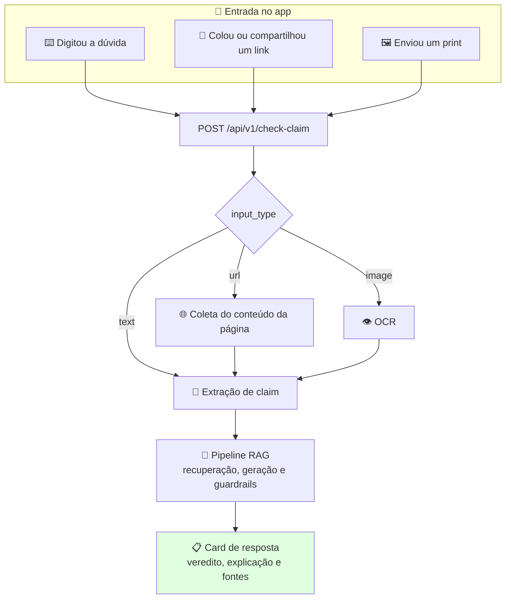
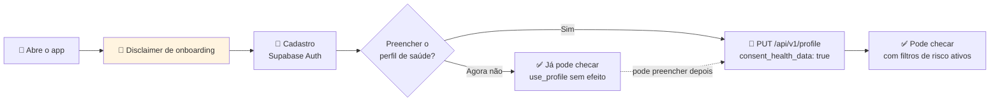

# Acesso e Canais da Aplicação

> **Referência:** GQ-User 2  
> **Responsável:** Matheus Moreira Lopes Perillo 
> **Status:** Respondido  

---

## 1. Escolha do Canal de Distribuição

A resposta da [GQ-User 2](../GQ.md) é **aplicativo mobile**, e a [Production/01](../Production/01_plataforma_e_deploy.md) já parte dela: React Native com Expo, distribuído por Expo EAS, consumindo a API por HTTPS. Esta seção registra por que o app venceu as alternativas, porque a decisão não é óbvia e vai ser questionada na apresentação.

### 1.1. Comparativo dos canais avaliados

| Canal | A favor | Contra | Veredito |
| :--- | :--- | :--- | :--- |
| **App mobile (React Native + Expo)** | Recebe print e link direto pelo menu de compartilhamento do sistema; permite conta e perfil de saúde; uma base de código para Android e iOS | Exige instalação, o maior atrito de aquisição | ✅ **Escolhido** |
| **Bot de WhatsApp** | Zero atrito de instalação; é onde a desinformação circula; alcança a persona Renata na plataforma dela | a API Business exige conta verificada e cobra por conversa, custo recorrente que o desafio não comporta; a interface de chat não acomoda o card de fontes expansível; guardar dado de saúde sensível nesse contexto agrava o problema de LGPD | ❌ Fora do MVP |
| **Site responsivo (PWA)** | Sem instalação; deploy mais simples | Compartilhar print de outro app para o navegador é péssimo no Android e pior no iOS, e esse é o gesto central do produto | ⚠️ Considerado como plano B |
| **Extensão de navegador** | Checagem no contexto do próprio post | O público do recorte primário consome rede social pelo celular, onde extensão não existe | ❌ Descartado |

### 1.2. Justificativa da escolha

Três fatores decidiram:

1. **O gesto principal é compartilhar, não digitar.** A jornada da [User/01](./01_personas.md), seção 5, começa com o Lucas dentro do Instagram olhando um post. O caminho mais curto dali até uma checagem é o botão *Compartilhar* do sistema operacional, e só um app instalado aparece nessa lista. Esse único fator elimina o PWA.
2. **O produto guarda dado de saúde sensível.** O perfil que aciona os filtros de grupo de risco ([Ethics/02](../Ethics/02_grupos_de_risco_e_filtros.md)) exige conta autenticada, consentimento explícito e caminho de exclusão. Isso pede uma sessão com identidade, não uma conversa em canal de terceiro.
3. **A resposta não é uma mensagem, é um card.** Veredito, faixa de risco, explicação e fontes expansíveis com DOI compõem uma estrutura visual. Espremer isso em balões de chat destrói a hierarquia que faz o Lucas ler o veredito primeiro.

> **Limitação assumida:** o app é o canal de maior atrito de aquisição entre os avaliados. A aposta é que o ganho de confiança e de estrutura compensa, e que o bot de WhatsApp entra depois do MVP como porta de entrada, delegando a checagem à mesma API.

### 1.3. Distribuição durante o desafio

Não há publicação nas lojas dentro do prazo. A distribuição para os testes e para a apresentação de 07/10 usa `expo-dev-client` e build interno do EAS, conforme a [Production/01](../Production/01_plataforma_e_deploy.md), seção 3, com instalação por link para a turma e para os entrevistados da validação de personas.

---

## 2. Modos de Entrada de Dados pelo Usuário

O contrato já implementado em `APP/schemas.py` aceita **três** modos de entrada, mutuamente complementares, sinalizados pelo campo `input_type`.

### 2.1. Os três modos

| Modo | `input_type` | Campo preenchido | Situação de uso | Tratamento no backend |
| :--- | :--- | :--- | :--- | :--- |
| **Texto livre** | `text` | `text` | O usuário formula a dúvida com as próprias palavras, muitas vezes em linguagem informal | Vai direto para a extração de claim ([Model/03](../Model/03_processamento_linguagem_internet.md)) |
| **Link** | `url` | `url` | Viu um post, vídeo ou notícia e quer checar aquele conteúdo específico | Coleta do conteúdo da página. No caso de vídeo, a transcrição ou a legenda ([Model/03](../Model/03_processamento_linguagem_internet.md), seção 4). Depois, extração de claim |
| **Print ou imagem** | `image` | `image_base64` | Recebeu um card no WhatsApp ou tirou print do story, onde não há link para copiar | OCR para extrair o texto, depois extração de claim (ver [Data/01](../Data/01_tipos_e_fontes_de_dados.md)) |

Em todos os casos o pedido carrega também `use_profile`, que por padrão é `true` e determina se o perfil de saúde do usuário entra na composição da resposta.



### 2.2. Exemplos de payload

O contrato completo, com a resposta e os códigos de erro, está na [Production/01](../Production/01_plataforma_e_deploy.md), seção 2.1.

```json
{ "input_type": "text",  "text": "água com limão em jejum queima gordura?", "use_profile": true }
{ "input_type": "url",   "url": "https://www.instagram.com/p/XXXXXXX/",     "use_profile": true }
{ "input_type": "image", "image_base64": "iVBORw0KGgoAAAANS...",            "use_profile": true }
```

A validação exige ao menos um entre `text`, `url` e `image_base64`. Pedido vazio recebe `400 invalid_input`, e imagem acima de 5 MB recebe `413 payload_too_large`.

### 2.3. Áudio fica fora do MVP

Entrada por áudio foi considerada e **não** entra nesta versão. O `input_type` aceita apenas `text`, `url` e `image`.

O motivo não é técnico apenas: transcrição acrescenta uma etapa de erro antes da extração de claim, e um erro de transcrição em termo clínico (confundir "glicemia" com "glicerina", por exemplo) contamina toda a cadeia sem deixar rastro visível para o usuário. Como o produto se sustenta na precisão da alegação checada, essa etapa extra não se paga no prazo do desafio. Fica registrada como candidata pós-MVP, principalmente por acessibilidade e por alcançar o perfil da persona Renata.

### 2.4. O que o app precisa entregar em cada modo

| Requisito | Por quê |
| :--- | :--- |
| Registrar-se como destino do *Compartilhar* do Android e do iOS para link e imagem | É o caminho de menor atrito a partir do feed (seção 1.2) |
| Detectar automaticamente se o conteúdo colado é URL ou texto | Poupa o usuário de escolher o `input_type` na mão |
| Comprimir a imagem no cliente antes do envio | Mantém o pedido abaixo do limite de 5 MB e respeita o plano de dados limitado do Lucas |
| Mostrar estado de carregamento com o claim já extraído | Confirma que o sistema entendeu a pergunta certa antes de a resposta chegar |

---

## 3. Primeiro Acesso e Perfil de Saúde

### 3.1. Fluxo de entrada



### 3.2. Por que o perfil é opcional

O perfil de saúde é o que aciona os filtros de proteção da [Ethics/02](../Ethics/02_grupos_de_risco_e_filtros.md), então seria tentador torná-lo obrigatório. Três razões pesaram contra:

1. **Dado de saúde é dado pessoal sensível** (LGPD, Art. 5º, II). Exigi-lo para usar o produto transforma consentimento em condição de acesso, o que descaracteriza o consentimento livre.
2. **Atrito no pior momento possível.** O Lucas chega com uma dúvida na mão. Um formulário clínico entre ele e a resposta é o ponto mais provável de desistência.
3. **Quem mais precisa do filtro é quem menos declara.** A persona Camila, da [User/01](./01_personas.md), seção 3.2, dificilmente informaria o transtorno alimentar. Um produto que só protege quem se declara não protege quem importa, e é por isso que a recusa segura precisa reagir ao conteúdo da consulta, não ao perfil.

Sem perfil preenchido, a resposta é a checagem baseada em evidência geral, com o disclaimer padrão da [Ethics/03](../Ethics/03_transparencia_e_disclaimers.md). O app relembra o preenchimento de forma não bloqueante, explicando o ganho concreto: respostas que levam em conta a condição de quem pergunta.

### 3.3. Controles que o usuário mantém

| Controle | Estado no MVP |
| :--- | :--- |
| Checar sem preencher perfil | ✅ Disponível |
| Desligar o perfil em uma consulta pontual (`use_profile: false`) | ✅ Já no contrato |
| Editar o perfil a qualquer momento (`PUT /profile`) | ⏳ Endpoint previsto, ainda não implementado |
| Apagar o perfil (`DELETE /profile`) | ⏳ Previsto para depois do MVP ([Production/01](../Production/01_plataforma_e_deploy.md), seção 2.3) |

---

## 4. Próximos Passos

- [ ] Implementar `GET` e `PUT /profile`, hoje o principal bloqueio para ativar os filtros de grupo de risco.
- [ ] Validar com a frente de Ética o texto do disclaimer de onboarding ([Ethics/03](../Ethics/03_transparencia_e_disclaimers.md), seção 2.2).
- [ ] Definir a estratégia de coleta para links de Instagram e TikTok, que restringem acesso automatizado ao conteúdo.
- [ ] Medir a taxa de uso por modo de entrada depois da demo interna, para saber se print e link realmente dominam sobre texto digitado.
