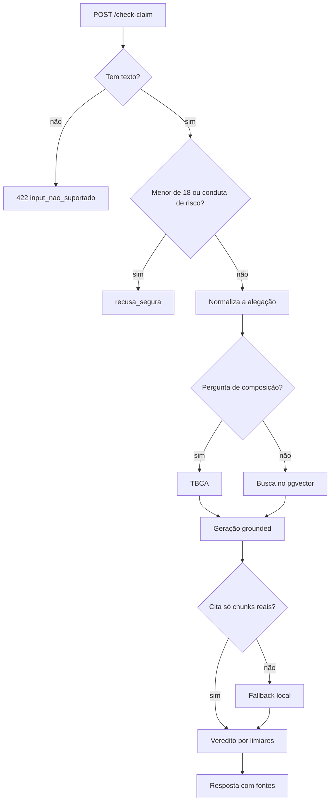

# Plano de implementação: Checagem com RAG e veredito

> Plano reconstruído em 07/10/2026 a partir do histórico do repositório. As etapas abaixo são as que de fato aconteceram, na ordem em que entraram.

## Visão da arquitetura

O pipeline roda em série dentro de uma rota síncrona do FastAPI. Os guardrails vêm primeiro e evitam custo de busca e de LLM. A busca usa embeddings multilingual-e5 no pgvector do Supabase. A geração tenta o modelo próprio (Ollama) e depois o Gemini, e dado sensível só usa o modelo próprio. O veredito sai do `risk_score` pelos limiares 0.35 e 0.65, e o `sem_evidencia` sai da busca vazia ou do campo `evidencia_suficiente`.

## Componentes e arquivos
| Arquivo | Papel |
|---|---|
| `APP/routers/check_claim.py` | Rota `POST /api/v1/check-claim` |
| `APP/model/pipeline.py` | Orquestra guardrails, TBCA, busca e geração |
| `APP/model/claim_extractor.py` | Normalização, reformulação amigável e recusa segura |
| `APP/model/disclaimers.py` | Menor de idade e avisos por perfil e veredito |
| `APP/model/classifier.py` | Padrões semânticos e cálculo de risco por evidência |
| `APP/model/retriever.py` | Busca no pgvector, TBCA e `low_coverage` |
| `APP/model/embeddings.py` | Embeddings da consulta |
| `APP/model/generator.py` | Geração grounded, validação de citações e fallback |
| `APP/model/llm.py` | Cadeia de provedores (próprio, Gemini) |
| `APP/model/prompts.py` | Prompts versionados, ativo `rag-v2.2` |
| `APP/model/resposta_local.py` | Resposta determinística sem LLM |
| `APP/verdict.py` | Limiares 0.35 e 0.65 |

## Etapas
1. Esqueleto da API e contrato congelado. Entregue no PR #1 (issue #35).
2. Log estruturado de inferência e endpoint de feedback. Entregue no PR #2 (issue #36).
3. Autenticação por JWT, rate limiting e perfil de saúde. Entregue no PR #6 (issue #37).
4. Pipeline de RAG, guardrails e LLM com provedores de reserva. Issues #7, #38. Entregue no PR #14 (modelo próprio com Ollama, dado sensível só nele, issue #12).
5. Fallback humanizado, prompt v2, observabilidade e benchmark. Entregue no PR #15 (issues #9 e #11).
6. Reformulação amigável de alegações com regex dinâmico. Entregue no PR #42 (issue #8).
7. Guardrails ampliados para seis frentes de risco. Entregue no PR #43 (issue #7).
8. Padrões semânticos ligados ao pipeline. Entregue no PR #44 (issue #10).
9. Teto de duração da função na Vercel alinhado com os timeouts. Entregue no PR #45 (issue #40).
10. Contrato do erro 422 `input_nao_suportado` documentado. Issue #39.
11. Veredito `sem_evidencia` quando os estudos não tratam da pergunta, com prompt `rag-v2.2`. Entregue no PR #61.
12. Tela do app deixa de oferecer envio de print enquanto a API não lê imagem. Entregue no PR #62.

## Testes
| Arquivo | Cobre |
|---|---|
| `tests/test_check_claim.py` | Contrato, erros e CORS da rota |
| `tests/test_check_claim_concorrencia.py` | Comportamento da rota com requisições concorrentes |
| `tests/test_pipeline.py` | Fluxo, limiares, validação de citações e fallback |
| `tests/test_veredito_sem_evidencia.py` | `sem_evidencia`, TBCA e `evidencia_suficiente` |
| `tests/test_review_correcoes.py` | 422 de imagem e link, desvio TBCA |
| `tests/test_guardrails.py` | Recusa segura e dúvidas legítimas |
| `tests/test_claim_extractor.py` | Normalização e reformulação |
| `tests/test_classifier.py` | Padrões semânticos |
| `tests/test_retriever.py` e `tests/test_retriever_observabilidade.py` | Busca e métricas da recuperação |
| `tests/test_llm.py` | Provedores, fallback e dado sensível |
| `tests/test_prompts.py` | Versões e formato dos prompts |
| `tests/test_resposta_local.py` | Resposta local determinística |
| `tests/test_verdict.py` | Limiares do veredito |
| `tests/test_benchmarks.py` e `tests/test_comparar_prompts.py` | Benchmark e comparação de prompts |

## Estado atual
| Item | Situação |
|---|---|
| Rota e contrato do check-claim | ✅ |
| Guardrails (menor de idade e condutas de risco) | ✅ |
| Busca semântica no pgvector | ✅ |
| Geração grounded com validação de citações | ✅ |
| Fallback local sem LLM | ✅ |
| Veredito `sem_evidencia` (`rag-v2.2`) | ✅ |
| Desvio para TBCA | 🟡 base com pouca cobertura de composição |
| `low_coverage` | 🟡 só logado, limiar 0.75 não calibrado |
| Leitura de print (OCR) e de link | ⬜ |
| Cache de respostas | ⬜ |

## Próximos passos
1. Ampliar a base com estudos e dados de composição de alimentos, para reduzir `sem_evidencia`.
2. Calibrar o `low_coverage` com o benchmark e decidir se entra no veredito.
3. Implementar OCR e leitura de link, e então reabrir o envio de print no app.
4. Medir a taxa de `sem_evidencia` em produção pelo log estruturado.
