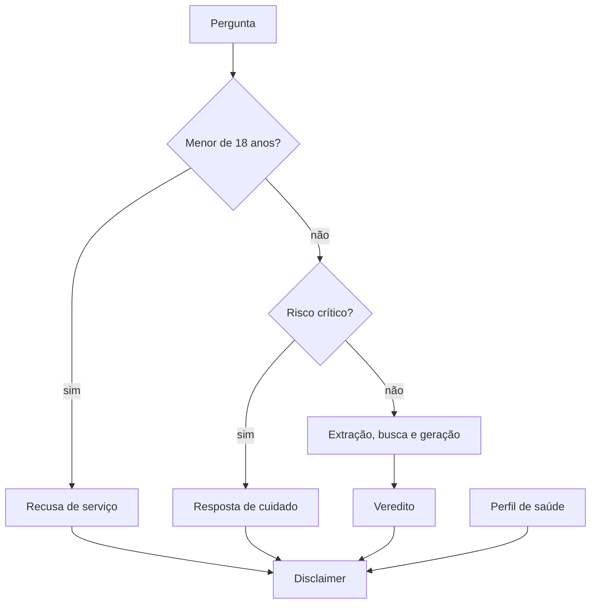

# Plano de implementação: Guardrails éticos, grupos de risco e avisos

> Plano reconstruído em 07/10/2026 a partir do histórico do repositório. As etapas abaixo são as que de fato aconteceram, na ordem em que entraram.

## Visão da arquitetura

Os guardrails rodam no início do pipeline, antes de busca e LLM. A recusa de idade vem primeiro, depois a de risco crítico. Em qualquer caminho, `montar_disclaimer` junta o aviso curto aos avisos da situação (evidência limitada, gestação, condição crônica), usando o texto da pergunta e as condições do perfil. No front, o veredito `recusa_segura` vira a tela de resultado de cuidado, e a restrição de idade tem tela própria.

## Componentes e arquivos
| Arquivo | Papel |
|---|---|
| APP/model/claim_extractor.py | `PADROES_RISCO_CRITICO`, `checar_recusa_segura`, `reformular_pergunta_amigavel` |
| APP/model/classifier.py | Padrões semânticos (mito, cautela, consenso) e score de risco |
| APP/model/disclaimers.py | Textos homologados, `e_menor_de_idade`, `montar_disclaimer` |
| APP/model/pipeline.py | Ordem dos guardrails e montagem da resposta de recusa |
| APP/routers/extract_claim.py | Devolve `safe_refusal` na extração rápida |
| APP/routers/profile.py | 403 `age_restricted` para perfil de menor |
| APP/schemas.py | Tipo `Veredito`, que inclui `recusa_segura` |
| web/src/telas/Bloqueado.tsx | Tela `/menor-de-idade` |
| web/src/lib/vereditos.ts | Rótulo e frase do veredito `recusa_segura` |
| Docs/Ethics/01, 02 e 03 | Fonte dos padrões, filtros e textos |

## Etapas
1. Issue #7 (Guardrails) e #8 (Regras amigáveis): primeiros padrões de recusa e reformulação da pergunta. Autenticação e perfil de saúde chegam no PR #6.
2. PR #42: reformulação amigável das alegações com regex dinâmico.
3. PR #43: guardrails expandidos para os cenários críticos (jejum extremo, tóxicos, compensatórios, medicamento, gestação, sem prescrição).
4. PR #44 (issue #10): padrões semânticos refinados em `classifier.py` e integrados ao pipeline.
5. Disclaimers homologados e recusa de menor de 18 anos, no pipeline e no perfil (módulo `disclaimers.py`, coberto por tests/test_disclaimers.py).
6. PR #47 e issues #19, #25 e #30: formulário de perfil com consentimento, aviso na resposta e bloqueio de menor no front.
7. Avisos a partir do perfil de saúde e geração sensível (tests/test_perfil_na_checagem.py). Entregue no PR #51 (o PR #48, que propôs isso primeiro, foi fechado e o conteúdo seguiu pelo #51).
8. Flag `safe_refusal` em `/extract-claim`, para a tela de carregamento (issue #26).

## Testes
- tests/test_guardrails.py: condutas barradas, dúvidas legítimas liberadas, estrutura da resposta de cuidado.
- tests/test_disclaimers.py: texto literal contra o documento de Ética, avisos por situação, detecção de menor, rota, cálculo de idade e perfil.
- tests/test_perfil_na_checagem.py: avisos e sensibilidade a partir do perfil.
- tests/test_classifier.py e tests/test_claim_extractor.py: padrões semânticos e reformulação.
- Front: web/src/telas/PerfilEdicao.test.tsx cobre o caminho para `/menor-de-idade`.
- A suíte não foi rodada na redação deste plano (a pasta é sincronizada e o pytest trava).

## Estado atual
| Item | Situação |
|---|---|
| Recusa segura por risco crítico | ✅ feito |
| Recusa de menor de 18 anos (pipeline e perfil) | ✅ feito |
| Tela `/menor-de-idade` | ✅ feito |
| Disclaimers homologados e conferidos por teste | ✅ feito |
| Avisos a partir do perfil | ✅ feito |
| Padrões semânticos e reformulação amigável | ✅ feito |
| Abertura específica do guardrail visível ao usuário | 🟡 parcial (some do texto exibido) |
| Verificação real de idade | ⬜ pendente |
| Revisão clínica dos padrões | ⬜ pendente |

## Próximos passos
- Decidir e implementar a abertura do guardrail como campo próprio da resposta da API, e exibi-la no front.
- Submeter a lista de padrões a revisão de profissional de saúde e ampliar com casos reais do log (flags, sem texto).
- Avaliar lista maior de condições crônicas para o aviso de condições clínicas.
- Registrar em teste o caso de falso positivo encontrado em uso real, quando aparecer.
