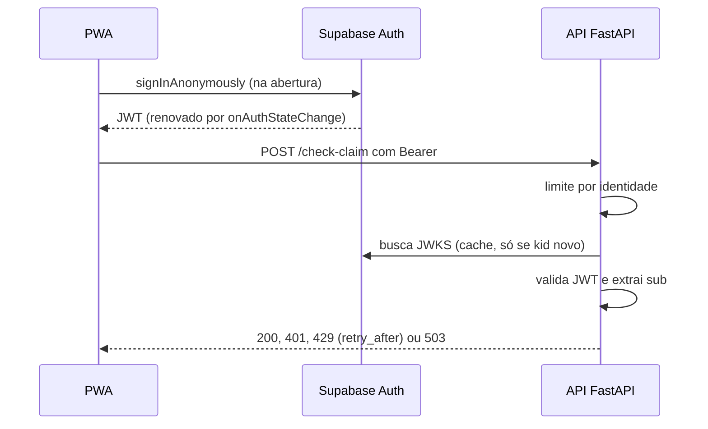

# Plano de implementação: Sessão, autenticação, limite de uso e conta

> Plano reconstruído em 07/10/2026 a partir do histórico do repositório. As etapas abaixo são as que de fato aconteceram, na ordem em que entraram.

## Visão da arquitetura

O app abre sem esperar o Supabase. A camada de rede espera o token por até 8 s. Na API, o limite roda antes da autenticação da rota e usa o hash do `sub` como chave (IP se não houver token válido). A validação acontece uma vez por requisição, em threadpool, e o resultado fica em `request.state`.

## Componentes e arquivos
| Arquivo | Papel |
| :--- | :--- |
| `APP/auth.py` | Validação do JWT (JWKS ou HS256), modo local, falha fechada, dependência `exigir_autenticacao` |
| `APP/ratelimit.py` | Limite por identidade em janela deslizante, `retry_after` real |
| `APP/routers/` (`feedback.py`, `extract_claim.py`, `profile.py`) | Aplicam `limitar` e `exigir_autenticacao` nas rotas |
| `web/src/lib/sessao.ts` | Login anônimo, renovação do token, `CONTA_DISPONIVEL`, criar conta, entrar e sair |
| `web/src/lib/api/cliente.ts` | Espera a sessão (8 s), mensagens de 401 e 429 |
| `web/src/telas/Conta.tsx` | Tela de conta (escondida enquanto a conta está desligada) |
| `web/src/telas/Perfil.tsx` | Perfil, lido da API com a sessão |
| `web/src/telas/BoasVindas.tsx` | Entrada; esconde "Já tenho conta" |
| `web/src/telas/Carregando.tsx` | Trata 429 voltando à tela de checar com o tempo de espera |
| `tests/test_auth.py`, `test_auth_jwks.py`, `test_auth_fail_closed.py`, `test_ratelimit.py` | Testes da API |
| `web/src/lib/sessao.test.ts`, `web/src/lib/api/cliente.sessao.test.ts` | Testes do front |

## Etapas
1. **JWT, rate limit e perfil na API.** Validação por segredo compartilhado, limite por identidade e perfil de saúde. Entregue pelo PR #6 (issue #37).
2. **Cliente com token fixo.** O front nasceu com um token de desenvolvimento enquanto a sessão real não existia (base do app, PR #17).
3. **Chaves assimétricas e falha fechada.** A API passou a validar por JWKS e `APP_ENV` ganhou padrão de produção, com validação única por requisição e threadpool. Cobertura em `tests/test_auth_jwks.py` e `tests/test_auth_fail_closed.py`. O PR exato não foi conferido.
4. **Tratamento de 429 e 401 na tela.** Mensagens, `retry_after` e volta à tela de checar. PR #54 (issue #20).
5. **Login anônimo suspenso.** O time achou que o recurso era pago e o adiou (issue #23, fechada).
6. **Sessão anônima.** `signInAnonymously`, renovação de token, ouvinte único e espera de 8 s na rede. Entrou no PR #60 (Dev), com correções de revisão no mesmo histórico de `sessao.ts`.
7. **Segurança do banco (06/10).** RLS ligado em `articles`, `chunks` e `sources`, com leitura apenas para `anon` e `authenticated`. Feito direto no Supabase.
8. **Conta desligada.** `CONTA_DISPONIVEL = false` e "Já tenho conta" escondido das boas-vindas. PR #63. A issue #24 (conta) está fechada, mas o recurso segue desligado.

## Testes
- API (pytest): `tests/test_auth.py` (401, expiração, audiência, `sub`, identidade estável, perfis isolados, modo local, configuração de produção), `tests/test_auth_jwks.py` (ES256, chave desconhecida, `none`, confusão de algoritmo, 503), `tests/test_auth_fail_closed.py` (padrão produção, validação única, busca lenta de chave), `tests/test_ratelimit.py` (limite, separação por usuário, renovação de token, `retry_after`, escrita separada).
- Front (vitest): `web/src/lib/sessao.test.ts`, `web/src/lib/api/cliente.sessao.test.ts`, `web/src/telas/Conta.test.tsx`, `web/src/telas/BoasVindas.test.tsx`.
- Não coberto: RLS do banco e o fluxo real de criar conta e entrar.

## Estado atual
| Item | Situação |
| :--- | :--- |
| Validação de JWT por JWKS e falha fechada | ✅ |
| Todos os endpoints exigem token | ✅ |
| Rate limit por identidade, com `retry_after` | ✅ |
| Sessão anônima no front, com renovação e espera de 8 s | ✅ |
| Tratamento de 401 e 429 na tela | ✅ |
| RLS nas tabelas de conhecimento | ✅ |
| Criar conta e entrar | 🟡 código existe, desligado por `CONTA_DISPONIVEL = false` |
| Rate limit compartilhado entre instâncias | ⬜ |
| CAPTCHA (Turnstile) no cadastro anônimo | ⬜ |
| Limpeza de usuários anônimos antigos | ⬜ |
| Limite de cadastros anônimos por IP | 🟡 padrão do Supabase (30/h), sem ajuste próprio |

## Próximos passos
1. Configurar o CAPTCHA no Supabase e enviar `captchaToken` no `signInAnonymously` antes de ligá-lo.
2. Criar a rotina de limpeza de usuários anônimos antigos.
3. Para religar a conta: configurar SMTP próprio (Gmail com senha de app ou Brevo), implementar o fluxo em duas etapas (`updateUser` com e-mail, link de confirmação, depois senha) e definir as URLs de retorno. Só então trocar `CONTA_DISPONIVEL` para `true`.
4. Trocar o `MemoryStorage` do limite por Redis (Upstash) ao escalar para mais de uma instância.
5. Registrar o RLS em migração versionada e cobrir com teste.
