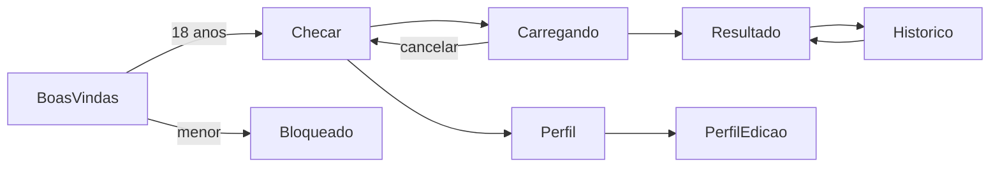

# Plano de implementação: App PWA, telas e fluxo do usuário

> Plano reconstruído em 07/10/2026 a partir do histórico do repositório. As etapas abaixo são as que de fato aconteceram, na ordem em que entraram.

## Visão da arquitetura

O app é uma SPA React 19 com Vite e `vite-plugin-pwa`. As telas chamam o cliente em `web/src/lib/api`, que fala com a API FastAPI (`/check-claim`, `/extract-claim`, `/feedback`, `/profile`). Em desenvolvimento, o MSW responde no lugar da API. Histórico, perfil, tema e rascunho ficam no `localStorage` por `lib/armazenamento.ts`. O estilo vem do design system em `Docs/Design`.

## Componentes e arquivos

| Arquivo | Papel |
|---|---|
| `web/src/App.tsx` | Rotas e guardas de tela |
| `web/src/telas/BoasVindas.tsx` | Termos, confirmação de 18 anos |
| `web/src/telas/Bloqueado.tsx` | Tela do menor de idade |
| `web/src/telas/Checar.tsx` | Entrada da alegação, exemplos, Colar, convite de instalação |
| `web/src/telas/Carregando.tsx` | Passos, "Entendi assim", cancelamento |
| `web/src/telas/Resultado.tsx` | Veredito, resposta, fontes, feedback, compartilhar |
| `web/src/telas/Historico.tsx` | Lista local e apagar |
| `web/src/telas/Perfil.tsx`, `PerfilEdicao.tsx` | Resumo, aparência, privacidade, formulário |
| `web/src/telas/Conta.tsx` | Criar e entrar (desligada) |
| `web/src/componentes/` | Botão, Campo, CardDeVeredito, ItemDeFonte, Avaliacao, FocoDeTela e outros |
| `web/src/lib/api/cliente.ts`, `tipos.ts` | Cliente e contrato |
| `web/src/lib/armazenamento.ts` | Estado local |
| `web/src/mocks/` | Handlers MSW de desenvolvimento |
| `web/src/estilos/` | `claudinho.css` e `app.css` |
| `web/vite.config.ts` | Manifest, `share_target`, `autoUpdate`, workbox |
| `web/vercel.json` | Fallback de SPA |
| `web/public/` | Ícones do PWA |

## Etapas

1. Protótipo, design system e versão em markdown: PR #16.
2. Base do projeto (contrato, cliente, mock, componentes, CI): issue #29. PWA com o caminho principal de checagem funcionando: PR #17.
3. Boas-vindas, termos e bloqueio de menor: issue #30.
4. Tela de checagem: issue #31. Carregando com cancelamento de verdade: issue #32.
5. Resultado e perfil: issues #33 e #34. Formulário do perfil de saúde com LGPD: PR #47.
6. "Entendi assim" durante o carregamento: issue #26, entregue no PR #51 (o #48, que propôs isso primeiro, foi fechado e o conteúdo seguiu pelo #51) e ajustado no PR #56.
7. Ícones do PWA e convite de instalação: issue #21, PR #49.
8. Limite de checagens e sessão expirada: issue #20, PR #54.
9. Histórico local e ícones atualizados: issue #18, PR #55 (fechado) e PR #57.
10. Share target para texto e link: issue #27, PR #60.
11. Ajustes finais: esconder print (PR #62), esconder "Já tenho conta" (PR #63), histórico igual ao protótipo (PR #64).
12. Passada de acessibilidade e 375 px: issue #28.

## Testes

- Vitest com Testing Library, arquivos `web/src/**/*.test.tsx`.
- Por tela: `BoasVindas`, `Checar`, `Carregando`, `Historico`, `Perfil`, `PerfilEdicao`, `Conta`.
- Fluxo de ponta a ponta com servidor simulado: `web/src/teste/fluxo.test.tsx`.
- Acessibilidade: `web/src/telas/acessibilidade.test.tsx`.
- Cliente e utilitários: `cliente.test.ts`, `cliente.sessao.test.ts`, `sessao.test.ts`, `resposta.test.ts`.
- A suíte não foi rodada ao escrever este plano.

## Estado atual

| Item | Situação |
|---|---|
| Boas-vindas, 18 anos, bloqueio | ✅ |
| Checar por texto | ✅ |
| Checar por print | ⬜ (desligado, API não lê imagem) |
| Checar por link | ⬜ (desligado, API não lê página) |
| Carregando com cancelamento e "Entendi assim" | ✅ |
| Resultado com fontes e feedback | ✅ |
| Histórico local | ✅ |
| Perfil e edição | ✅ |
| Conta | 🟡 (tela existe, desligada) |
| Ícones e convite de instalação | ✅ |
| Share target | 🟡 (no manifest, mas o app não aparece no Instagram/TikTok) |
| Atualização automática | ✅ |
| Acessibilidade e 375 px | ✅ |
| Release na main (PR #58) | 🟡 (aberto) |

## Próximos passos

- Religar print e link quando a API passar a ler imagem e página (trocar as constantes em `Checar.tsx`).
- Habilitar a conta e a sessão, e então mostrar de novo o "Já tenho conta".
- Investigar por que o app não aparece no compartilhar de Instagram e TikTok.
- Fechar o release do PR #58.
