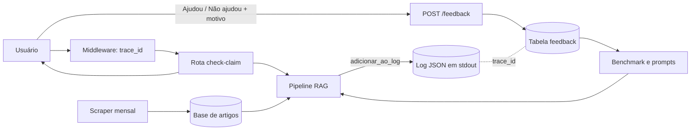

# Plano de implementação: Observabilidade, feedback e avaliação (MLOps)

> Plano reconstruído em 07/10/2026 a partir do histórico do repositório. As etapas abaixo são as que de fato aconteceram, na ordem em que entraram.

## Visão da arquitetura

O middleware cria o `trace_id` e um registro por requisição. A rota e o pipeline o enriquecem com `adicionar_ao_log`, e ele é emitido em stdout no fim. A resposta devolve o `trace_id`, e o feedback do usuário volta ligado a ele. Isso permite achar a execução exata de uma avaliação negativa. As avaliações e o benchmark offline orientam mudanças de prompt, e o scraper mensal atualiza a base (o "retreino" de um sistema de RAG).

## Componentes e arquivos

| Componente | Arquivo |
|---|---|
| Contexto e emissão do log, hash do usuário | `APP/observabilidade.py` |
| Um registro por requisição | `APP/middleware.py` |
| Sinais da recuperação (`low_coverage`) | `APP/model/retriever.py` |
| `evidencia_suficiente`, versões | `APP/model/generator.py`, `APP/routers/check_claim.py` |
| Versões de prompt | `APP/model/prompts.py` |
| Endpoint de feedback | `APP/routers/feedback.py` |
| Persistência do feedback | `APP/repositorios/feedback.py`, `deploy/sql/001_profiles_e_feedback.sql` |
| Contrato (`FeedbackRequest`, motivos) | `APP/schemas.py` |
| UI de avaliação | `web/src/componentes/Avaliacao.tsx` |
| Avaliação offline | `benchmarks/avaliar_pipeline.py`, `metricas.py`, `dataset_benchmark.json` |
| Comparação de prompts | `benchmarks/comparar_prompts.py`, `comparacao_prompts.md` |
| Estresse e partida a frio | `benchmarks/estresse.py`, `benchmarks/cold_start.py` |
| Atualização da base | `.github/workflows/article_scraper.yml` |

## Etapas

1. Contrato e esqueleto da API, com o `trace_id` previsto na resposta. Issue #35, PR #1.
2. Log estruturado de inferência e endpoint de feedback. Issue #36, PR #2 (o PR #4, que tentava o mesmo, foi fechado).
3. Observabilidade na produção: fallback humanizado, prompt v2, benchmark e testes. Issues #9 e #11, PR #15.
4. Tela de resultado com veredito, fontes e avaliação. Issue #33, PR #17.
5. Persistência do feedback no Supabase (tabela `feedback`, com índices por data e por motivo) junto da persistência de perfil. Entregue no PR #51 (o #48, que propôs isso primeiro, foi fechado e o conteúdo seguiu pelo #51).
6. Scraper automático do PubMed, mensal, como gatilho de atualização da base. Issue #50, PR #53.
7. Sinal de qualidade `evidencia_suficiente` e veredito `sem_evidencia`. PR #61.
8. Revisões de prompt até a `rag-v2.2`, hoje ativa em `APP/model/prompts.py`.

## Testes

- `tests/test_logging_estruturado.py`: um registro por requisição, hash do usuário, texto fora do log.
- `tests/test_configuracao_de_log.py`: configuração do logger.
- `tests/test_retriever_observabilidade.py`: sinais de recuperação no log.
- `tests/test_perfil_na_checagem.py`: perfil usado só como booleano e falha sem derrubar a checagem.
- `tests/test_feedback.py` e `tests/test_repositorio_feedback.py`: endpoint, autenticação e repositórios.
- `tests/test_benchmarks.py`: métricas, código de saída, estresse.
- `tests/test_comparar_prompts.py` e `tests/test_prompts.py`: comparação e versões de prompt.
- Front: o componente de avaliação usa o mock em `web/src/mocks/handlers.ts`.

## Estado atual

| Item | Situação |
|---|---|
| Log JSON por requisição com `trace_id` | ✅ |
| Privacidade do log (sem texto, só booleanos) | ✅ |
| Versões de modelo e prompt no log | ✅ |
| Sinais `low_coverage`, `evidencia_suficiente`, `safe_refusal` | ✅ |
| Endpoint e tabela de feedback | ✅ |
| UI de avaliação com motivos | ✅ |
| Benchmark offline com quality gate por código de saída | ✅ |
| Dataset de benchmark | 🟡 10 casos (meta: 50) |
| Comparação de prompts | 🟡 v1.0 x v2.0; a v2.2 ativa não foi comparada |
| Atualização da base por agenda | 🟡 scraper mensal; sem checagem de frescura |
| Gate de qualidade no CI | ⬜ TODO no `ci.yml` |
| RAGAS | ⬜ |
| Sentry e Langfuse | ⬜ pós-MVP |
| Painel e alertas de drift | ⬜ pós-MVP |
| Tags semânticas e prompts em arquivos separados | ⬜ |

## Próximos passos

1. Rodar `comparar_prompts` incluindo a `rag-v2.2` e registrar a linha de base.
2. Crescer o dataset para 50 casos, usando avaliações "Não ajudou" como fonte de casos novos.
3. Ligar `avaliar_pipeline` ao CI com `--min-recall` e `--min-f2`.
4. Escolher entre Langfuse e um painel simples sobre o log, e só então alertas de `low_coverage` e `sem_evidencia`.
5. Decidir se o motivo do "Não ajudou" passa a ser obrigatório, depois de medir quanto feedback chega sem motivo.
6. Revisar a doc de produção para separar o que existe do que é plano.
