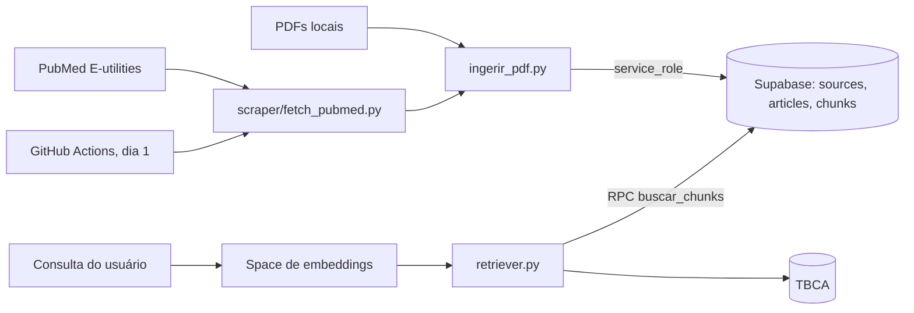

# Plano de implementação: Base de conhecimento (dados, ingestão e atualização)

> Plano reconstruído em 07/10/2026 a partir do histórico do repositório. As etapas abaixo são as que de fato aconteceram, na ordem em que entraram.

## Visão da arquitetura

Dois caminhos alimentam a base: PDFs ingeridos na máquina de quem mantém o projeto e a coleta mensal do PubMed. O scraper reaproveita as funções de divisão em chunks e de embeddings da ingestão de PDF. Ambos escrevem com a `service_role`. Na leitura, a API gera o embedding da consulta (modelo e5, prefixo `query: `), chama `buscar_chunks` por RPC e consulta a TBCA para dados de alimentos.

## Componentes e arquivos

- `migracao_chunks.sql`: cria `chunks`, ajusta o vetor para 768 e define `buscar_chunks`.
- `ingerir_pdf.py` e `requirements-ingestao.txt`: ingestão de PDFs.
- `scraper/fetch_pubmed.py`, `scraper/requirements.txt`, `scraper/README.md`: coleta do PubMed.
- `.github/workflows/article_scraper.yml`: agenda mensal e execução manual.
- `APP/model/embeddings.py` e `deploy/embeddings-space`: embedding da consulta.
- `APP/model/retriever.py`: busca de chunks, catálogo de artigos, `LIMIAR_BAIXA_COBERTURA` e `buscar_alimento_tbca`.
- `APP/model/train.py`: treino do classificador de risco (experimento, fora de produção).
- `Docs/Data/01_tipos_e_fontes_de_dados.md`, `Docs/Data/02_armazenamento_e_estrutura.md`, `Docs/Model/04_treinamento_e_classificador_risco.md`.

## Etapas

1. Schema no Supabase (`sources`, `articles`, `chunks`) e documentação em `Docs/Data`. Não consegui ligar esta etapa a um PR específico.
2. Migração `migracao_chunks.sql`: HNSW com cosseno, vetor de 768 dimensões e função `buscar_chunks`.
3. Ingestão local de PDFs com embeddings e deduplicação por `sha256`. PR não identificado no histórico consultado.
4. Embeddings da consulta com e5-base, com cliente remoto e Space dedicado, para a função serverless não carregar o torch (`tests/test_embeddings.py`).
5. Retriever com `buscar_chunks`, catálogo de artigos e consulta à TBCA (`APP/model/retriever.py`).
6. Scraper do PubMed e workflow mensal: issue #50, entregue no PR #53.
7. Experimento de treino do classificador de risco, que não foi para produção. O PR #13 (modelo e treinamento v.1) foi fechado sem merge e o #41 (Feat/model) também. Qual deles originou o `train.py` atual não foi verificado.
8. Endurecimento de segurança em 06/10: RLS em `articles`, `chunks` e `sources`, leitura pública e escrita só pela `service_role`. A ingestão passa a exigir essa chave.

## Testes

- `tests/test_embeddings.py`: formato do Space e da HF Inference, prefixo `query:` sem duplicar, vetor de dimensão errada, falha do provedor (503, não "sem evidência"), contrato entre cliente e serviço.
- `tests/test_retriever.py`: datas de publicação, formatação de contexto e busca de evidências com mocks.
- Não há teste dedicado para `ingerir_pdf.py` nem para `scraper/fetch_pubmed.py`. Nesta rodada de documentação os testes não foram executados.

## Estado atual

| Item | Situação |
| :--- | :--- |
| Schema e `buscar_chunks` | ✅ feito |
| Ingestão de PDF com deduplicação | ✅ feito |
| Scraper do PubMed e workflow mensal | ✅ feito |
| Embeddings da consulta (Space) | ✅ feito |
| RLS com escrita só pela `service_role` | ✅ feito |
| Consulta à TBCA | 🟡 parcial (leitura no código, sem rotina de carga versionada) |
| Cobertura de composição de alimentos | 🟡 parcial (base pende para dietas da moda e desinformação) |
| Testes da ingestão e do scraper | ⬜ pendente |
| Calibração do limiar 0.75 | ⬜ pendente |
| Classificador treinado em produção | ⬜ pendente (experimento, em uso o de regras) |

## Próximos passos

1. Ingerir estudos e tabelas de composição de alimentos para reduzir os casos de "Faltam estudos".
2. Calibrar `LIMIAR_BAIXA_COBERTURA` com consultas reais.
3. Versionar a carga da TBCA (o SQL do RLS já está em `deploy/sql/002_rls_base_cientifica.sql`).
4. Escrever testes com mocks para a divisão em chunks, a deduplicação e o parse de datas do PubMed.
5. Revisar os termos MeSH e o teto de 5000 IDs para trazer estudos mais próximos das alegações vistas na internet.
6. Decidir se o `ingerir_pdf.py` entra de vez no repositório, já que o scraper depende dele.
