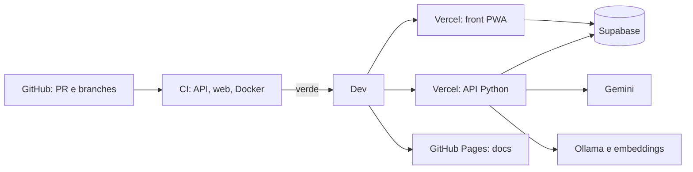

# Plano de implementação: Deploy, CI e fluxo de trabalho

> Plano reconstruído em 07/10/2026 a partir do histórico do repositório. As etapas abaixo são as que de fato aconteceram, na ordem em que entraram.

## Visão da arquitetura

Todo código entra por PR. O CI roda API, web e build da imagem Docker; o ruleset só libera o merge com os checks verdes. A integração Git da Vercel publica a API (função Python) e o front (projeto separado) a partir da `Dev`. A API usa Supabase, Gemini como provedor externo e Ollama próprio como alternativa, além do Space de embeddings. Não há prévia por PR.

## Componentes e arquivos

- `.github/workflows/ci.yml`: jobs "Lint e testes (API)", "Build da imagem Docker" e "Lint e testes (web)".
- `.github/workflows/docs.yml`: mkdocs para o GitHub Pages.
- `.github/workflows/article_scraper.yml`: scraper mensal do PubMed (`scraper/`).
- `vercel.json`, `api/index.py`: função da API.
- `web/vercel.json`, `web/.env.example`: projeto do front.
- `Dockerfile`, `docker-compose.yml`, `web/Dockerfile`: ambiente local.
- `deploy/ollama-space`, `deploy/ollama-azure`, `deploy/embeddings-space`, `deploy/sql`: serviços de apoio.
- `Docs/Production/01` e `03`: plataforma, deploy e escalabilidade.

## Etapas

1. Esqueleto da API e proteção do `.env` (PR #1, issue #35).
2. CI e base do front, com contrato, mock e componentes (issue #29, PR #17).
3. LLM próprio com Ollama e provedores de reserva, com serviços em `deploy/` (PR #14, issue #12, issue #38).
4. Pipeline de RAG e deploy da API na Vercel (issue #38, PR #15).
5. Alinhamento do teto da função com a cadeia de timeouts: `maxDuration` 300 (issue #40, PR #45).
6. Link da documentação no GitHub Pages no README (PR #46).
7. Scraper mensal de artigos no Actions (issue #50, PR #53).
8. Ruleset das branches `main` e `Dev`, com checks obrigatórios e aprovação só na `main`.
9. Tentativa de job de deploy no CI (PRs #59 e #60), removida: a Vercel publica pela integração Git.
10. Correções finais de front e API até a demo (PRs #61 a #64, #66).
11. Release da `Dev` para a `main` (PR #58, aberto na data deste documento).

## Testes

- API: `pytest -q -rxX` no CI, com black e ruff antes.
- Web: oxlint, prettier, vitest e `npm run build`.
- Docker: `docker build` da imagem da API.
- Local: rodar os testes numa cópia do repositório fora da pasta sincronizada, que trava pytest, vitest e git.
- Verificação de deploy é manual: abrir o app publicado e conferir uma checagem de ponta a ponta.

## Estado atual

| Item | Situação |
|---|---|
| CI de API, web e Docker | ✅ feito |
| Ruleset da `Dev` e da `main` | ✅ feito |
| Deploy da API na Vercel (300 s) | ✅ feito |
| Deploy do front na Vercel (fallback de SPA) | ✅ feito |
| Documentação no GitHub Pages | ✅ feito |
| Scraper mensal | ✅ feito |
| Ambiente local com Docker | ✅ feito |
| Serviços Ollama e embeddings | ✅ feito |
| Release `Dev` para `main` | 🟡 PR #58 aberto |
| Prévia por PR | ⬜ pendente |
| Smoke test pós-deploy automatizado | ⬜ pendente |

## Próximos passos

- Concluir a release (PR #58) com a aprovação exigida pela `main`.
- Recarregar o PWA uma vez antes da demo, para pegar a versão nova.
- Conferir `VITE_SUPABASE_URL` e `VITE_SUPABASE_ANON_KEY` no projeto do front e refazer o deploy se mudarem.
- Avaliar prévia por PR e smoke test pós-deploy.
- Documentar o rodízio de segredos (Vercel e GitHub).
