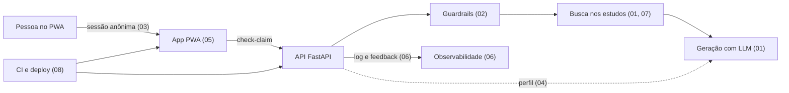

# Specs e planos de implementação

> Consolidados em 07/10/2026 a partir do código, das issues e dos PRs do repositório. Não são o planejamento original: registram o que foi construído, o que ficou de fora e por quê. Cada afirmação aponta para o arquivo, o teste, a issue ou o PR que a comprova.

O Claudinho foi construído por issues e PRs revisados, com as decisões espalhadas entre a documentação de cada frente (`Docs/Model`, `Docs/Ethics`, `Docs/Production`, `Docs/Data`, `Docs/User`, `Docs/Design`) e as discussões de revisão. Esta seção junta tudo por funcionalidade, em dois documentos:

- **Spec:** o problema, o objetivo, o escopo (inclusive o que ficou de fora), os requisitos, os critérios de aceite marcados como feitos ou pendentes, e as decisões com o motivo.
- **Plano:** a arquitetura, os arquivos, as etapas na ordem em que de fato entraram (com o PR de cada uma), os testes que cobrem, o estado atual e os próximos passos.

## Funcionalidades

| # | Funcionalidade | Spec | Plano |
| :--- | :--- | :--- | :--- |
| 01 | Checagem com RAG e veredito | [spec](01-checagem-rag/spec.md) | [plano](01-checagem-rag/plano.md) |
| 02 | Guardrails éticos e avisos | [spec](02-guardrails-etica/spec.md) | [plano](02-guardrails-etica/plano.md) |
| 03 | Sessão, autenticação e conta | [spec](03-sessao-autenticacao/spec.md) | [plano](03-sessao-autenticacao/plano.md) |
| 04 | Perfil de saúde e LGPD | [spec](04-perfil-saude-lgpd/spec.md) | [plano](04-perfil-saude-lgpd/plano.md) |
| 05 | App PWA: telas e fluxo | [spec](05-app-pwa/spec.md) | [plano](05-app-pwa/plano.md) |
| 06 | Observabilidade, feedback e avaliação | [spec](06-observabilidade-feedback/spec.md) | [plano](06-observabilidade-feedback/plano.md) |
| 07 | Base de conhecimento: dados e ingestão | [spec](07-dados-ingestao/spec.md) | [plano](07-dados-ingestao/plano.md) |
| 08 | Deploy, CI e fluxo de trabalho | [spec](08-deploy-ci/spec.md) | [plano](08-deploy-ci/plano.md) |

## Como o sistema se encaixa

## Convenções

- Critérios de aceite: `[x]` implementado e coberto, `[ ]` pendente.
- Estado atual: ✅ feito, 🟡 parcial, ⬜ pendente.
- Números como `#61` são PRs ou issues do repositório.
